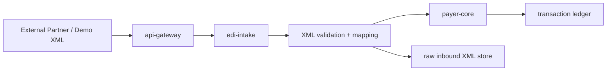

# ASHN Future Enhancements TODO

This backlog captures the next useful build paths for ASHN after the current JSON-backed X12 simulation. The north star is to keep the project demoable while gradually moving closer to real healthcare EDI patterns.

## Recommended Next Milestone

Build an **EDI intake service** that accepts XML payloads, validates them, converts them into ASHN's internal transaction model, and forwards accepted work to `payer-core`.

This keeps `payer-core` focused on business state while giving us a clean place to experiment with external data formats.

## Priority Backlog

### P0 — XML EDI Intake Service

- [x] Add a new `apps/edi-intake` service.
- [x] Expose `POST /x12/xml` for XML transaction submissions.
- [x] Accept `Content-Type: application/xml` and `text/xml`.
- [x] Parse XML into a neutral inbound envelope.
- [x] Detect transaction type: `834`, `270`, `278`, `837`, `276`, `835`, `820`.
- [x] Validate required fields per transaction type.
- [x] Return structured validation errors for malformed or incomplete XML.
- [x] Convert accepted XML into ASHN payer requests.
- [x] Forward accepted work to `payer-core` through internal HTTP APIs.
- [x] Add gateway route `POST /v1/x12/xml`.
- [x] Add unit tests for valid XML, invalid XML, missing fields, and unsupported transaction types.
- [ ] Persist raw inbound XML for audit/debug replay.
- [ ] Add DB-backed integration tests through `api-gateway → edi-intake → payer-core`.

Suggested service boundary:



Why this deserves a new service:

- XML and X12 parsing concerns are different from payer business logic.
- External payload validation should not clutter `payer-core`.
- It gives us a realistic integration boundary for partner submissions.
- It can later support raw X12, XML, JSON, file drops, and async queues.

Important nuance: real X12 is often exchanged as delimiter-based EDI text rather than XML. Many enterprise systems also use XML wrappers, canonical XML, or XML-based integration contracts around EDI workflows. For ASHN, XML is a good next step because it is easier to inspect, validate, demo, and map into our domain model before we add raw X12 segment parsing.

### P1 — Raw X12 Generation

- [ ] Generate raw X12-like strings alongside the current JSON payloads.
- [ ] Add envelope segments: `ISA`, `GS`, `ST`, `BHT`, `SE`, `GE`, `IEA`.
- [ ] Add transaction-specific segment examples for `834`, `270`, `271`, `278`, `837`, `835`, `276`, and `277`.
- [ ] Store raw X12 text on each ledger transaction.
- [ ] Show raw X12 in the dashboard transaction detail panel.
- [ ] Add copy/download buttons for raw transaction payloads.

### P1 — Acknowledgments

- [ ] Add `999` implementation acknowledgment for accepted or rejected syntax.
- [ ] Add `277CA` claim acknowledgment after `837` submission.
- [ ] Track acknowledgment relationships between source transactions and responses.
- [ ] Add dashboard filters for original transaction vs acknowledgment.
- [ ] Add tests for accepted and rejected acknowledgment flows.

### P1 — Asynchronous Processing

- [ ] Turn `apps/tx-worker` into an active worker service.
- [ ] Add a transaction queue table or lightweight message queue.
- [ ] Move long-running authorization and adjudication work off the request path.
- [ ] Add retry, dead-letter, and replay behavior.
- [ ] Show async status transitions in the dashboard.

### P2 — Prior Authorization Lifecycle

- [ ] Add explicit `278` approval and denial endpoints.
- [ ] Add authorization review state: `Pending`, `Approved`, `Denied`, `Expired`.
- [ ] Add severity and service-type rules for auto-approval.
- [ ] Link authorization decisions to downstream claims.
- [ ] Show authorization history in claim detail views.

### P2 — Claim Adjudication

- [ ] Add adjudication rules based on provider tier, adventurer rank, severity, and coverage status.
- [ ] Calculate allowed amount, patient responsibility, paid amount, and denial reasons.
- [ ] Add denial and partial-payment scenarios.
- [ ] Expand `835` payloads with claim adjustment and remittance details.
- [ ] Add tests for paid, denied, and partially paid claims.

### P2 — Trading Partners and Routing

- [ ] Add trading partner records.
- [ ] Add sender/receiver identifiers distinct from internal IDs.
- [ ] Add routing rules by transaction type and partner.
- [ ] Add partner-specific validation profiles.
- [ ] Add dashboard pages for partner configuration.

### P2 — Dashboard Enhancements

- [ ] Add a transaction timeline view grouped by adventurer or claim.
- [ ] Add saved filters for transaction type, status, provider, and date range.
- [ ] Add raw payload tabs: JSON, XML, and X12.
- [ ] Add ledger export to JSON, XML, and CSV.
- [ ] Add visual links between request/response transaction pairs.

### P3 — Security and Operational Readiness

- [ ] Add API authentication for partner-facing endpoints.
- [ ] Add request IDs and correlation IDs across services.
- [ ] Add structured logs.
- [ ] Add basic OpenTelemetry traces.
- [ ] Add health checks for every service in Docker Compose.
- [ ] Add migration tests and seed-data reset tests.
- [ ] Add rate limiting for public/demo endpoints.

## Proposed XML Shape

The first XML contract should be intentionally simple and canonical. It does not need to mirror every real X12 segment on day one.

Example `837` claim submission:

```xml
<AshnX12Transaction type="837">
  <Sender id="provider-vitesse-temple" />
  <Receiver id="Adventure Society" />
  <Claim>
    <AdventurerId>adventurer-id</AdventurerId>
    <ProviderId>provider-vitesse-temple</ProviderId>
    <IncidentSeverity>Awakened</IncidentSeverity>
    <AmountCents>125000</AmountCents>
  </Claim>
</AshnX12Transaction>
```

Example `270` eligibility inquiry:

```xml
<AshnX12Transaction type="270">
  <Sender id="provider-vitesse-temple" />
  <Receiver id="Adventure Society" />
  <EligibilityInquiry>
    <AdventurerId>adventurer-id</AdventurerId>
    <ProviderId>provider-vitesse-temple</ProviderId>
  </EligibilityInquiry>
</AshnX12Transaction>
```

## Proposed Implementation Order

1. Create `apps/edi-intake` with health check and XML parsing.
2. Add domain structs for inbound XML envelopes.
3. Add tests for XML decoding and validation.
4. Add gateway route: `POST /v1/x12/xml`.
5. Forward accepted XML requests into existing `payer-core` endpoints.
6. Persist raw XML alongside generated transaction records.
7. Add dashboard XML payload display.
8. Add raw X12 generation after XML intake is stable.

## Open Architecture Questions

- Should XML intake call existing `payer-core` endpoints or write transactions directly through a shared package?
- Should raw inbound payloads live in the existing `transactions` table or a new `inbound_messages` table?
- Should `api-gateway` expose `/v1/x12/xml`, or should partner endpoints live directly on `edi-intake`?
- Do we want canonical ASHN XML first, or transaction-specific XML documents per X12 type?
- Should rejected XML submissions still create audit records?

## Decision Recommendation

Start with canonical ASHN XML through a new `edi-intake` service. Keep the XML contract small, strongly validated, and easy to demo. Once that works, add raw X12 segment generation and acknowledgments.

That path gets us closer to real enterprise EDI without burying the project in full X12 implementation complexity too early.
