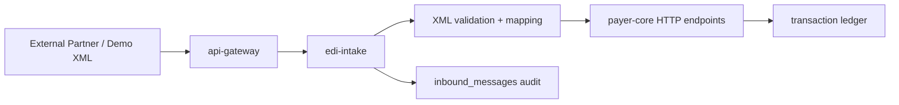

# ASHN Future Enhancements TODO

This backlog captures what ASHN already supports and the next useful build paths now that the project has moved beyond the original JSON-only simulator. The north star is to keep the project demoable while gradually moving closer to real healthcare EDI integration patterns.

## Current Foundation

ASHN now has a working EDI intake boundary that accepts canonical XML/JSON payloads plus first-pass raw X12 `834`/`820`/`270`/`276`/`278`/`837`/`835`/`275`, validates them, converts them into ASHN's internal transaction model, audits every submission, and forwards accepted work to `payer-core`.

This keeps `payer-core` focused on business state while giving us a clean place to experiment with external data formats, trading partner rules, replay, and broader raw X12 intake.

## Recommended Next Milestone

Move ASHN from a strong integration lab into a richer training/demo environment: deepen raw X12 intake beyond the current demo subset, add optional file-drop intake, deepen benefit-plan and service-line adjudication rules, expand partner-specific companion-guide variants, and add operational views for audit errors, retries, and rejection trends.

## Priority Backlog

### P0 — XML EDI Intake Service

- [x] Add a new `apps/edi-intake` service.
- [x] Expose `POST /x12/xml` for XML transaction submissions.
- [x] Accept `Content-Type: application/xml` and `text/xml`.
- [x] Parse XML into a neutral inbound envelope.
- [x] Detect transaction type: `834`, `270`, `275`, `278`, `837`, `276`, `835`, `820`.
- [x] Validate required fields per transaction type.
- [x] Return structured validation errors for malformed or incomplete XML.
- [x] Convert accepted XML into ASHN payer requests.
- [x] Forward accepted work to `payer-core` through internal HTTP APIs.
- [x] Add gateway route `POST /v1/x12/xml`.
- [x] Add unit tests for valid XML, invalid XML, missing fields, and unsupported transaction types.
- [x] Persist raw inbound XML for audit/debug replay.
- [x] Add DB-backed integration tests through `api-gateway → edi-intake → payer-core`.
- [x] Add multipart file-drop intake for batch/demo XML, JSON, EDI, and X12 payloads.

Suggested service boundary:



Why this deserves a new service:

- XML and X12 parsing concerns are different from payer business logic.
- External payload validation should not clutter `payer-core`.
- It gives us a realistic integration boundary for partner submissions.
- It supports XML, JSON, first-pass raw X12, and can later add file drops and async queues.
- `payer-core` remains the source of truth for business rules, state transitions, transaction generation, and async jobs.

Important nuance: real X12 is often exchanged as delimiter-based EDI text rather than XML. Many enterprise systems also use XML wrappers, canonical XML, or XML-based integration contracts around EDI workflows. ASHN now uses XML/JSON for readable canonical demos and a small raw X12 parser for `834`, `820`, `270`, `276`, `278`, `837`, `835`, and `275` segment intake.

## XML Intake Architecture Decisions

- **Routing:** Public submissions go through `api-gateway` at `POST /v1/x12/transactions` for content-negotiated XML/JSON intake. `POST /v1/x12/xml` remains as an XML compatibility route.
- **Business ownership:** `edi-intake` does not write payer transactions directly. It validates, maps, audits, and calls existing `payer-core` endpoints so one service owns business behavior.
- **Canonical contract:** Start with one canonical ASHN transaction envelope. XML uses `<AshnX12Transaction type="837">`; JSON uses the same shape with `type`, `sender`, `receiver`, and transaction-specific payload objects. Transaction-specific or partner-specific schemas can layer on later.
- **Audit policy:** Accepted and rejected XML submissions both create `inbound_messages` audit records. Rejections keep raw payload, error, transaction type when detectable, and downstream status when applicable.
- **Representation model:** Treat XML and JSON like Rails-style representations at the API edge: the gateway exposes one public workflow surface while intake services translate content types into canonical domain requests.

### P1 — Raw X12 Generation

- [x] Generate raw X12-like strings alongside the current JSON payloads.
- [x] Add envelope segments: `ISA`, `GS`, `ST`, `BHT`, `SE`, `GE`, `IEA`.
- [x] Add transaction-specific segment examples for `834`, `270`, `271`, `275`, `278`, `837`, `835`, `276`, and `277`.
- [x] Store raw X12 text on each ledger transaction.
- [x] Show raw X12 in the dashboard transaction detail panel.
- [x] Parse raw X12 `834` enrollment into canonical enrollment requests.
- [x] Parse raw X12 `820` premium payments into canonical premium payment requests.
- [x] Parse raw X12 `270` eligibility into canonical eligibility requests.
- [x] Parse raw X12 `276` claim status into canonical status requests.
- [x] Parse raw X12 `278` prior authorization into canonical authorization requests.
- [x] Parse raw X12 `835` remittance/payment into canonical payment requests.
- [x] Add copy buttons for raw transaction payloads.
- [x] Add download buttons for raw transaction payloads.
- [x] Expand segment generation toward companion-guide examples.
- [x] Add XML intake validation rules per transaction type.
- [x] Add profile-based companion-guide-style validation per trading partner.

### P1 — Acknowledgments

- [x] Add `999` implementation acknowledgment for accepted or rejected syntax.
- [x] Add `277CA` claim acknowledgment after `837` submission.
- [x] Track acknowledgment relationships between source transactions and responses.
- [x] Add dashboard filters for acknowledgment transaction types.
- [x] Add tests for accepted and rejected acknowledgment flows.
- [ ] Add `824` application reporting for `275` attachment validation failures.
- [ ] Add `TA1` interchange acknowledgment/rejection for ISA/IEA pre-screen failures.
- [ ] Distinguish syntax acknowledgments, attachment validation responses, and business review outcomes in transaction relationships.

### P1 — Asynchronous Processing

- [x] Turn `apps/tx-worker` into an active worker service.
- [x] Add a transaction queue table or lightweight message queue.
- [x] Move long-running authorization and adjudication work off the request path.
- [x] Add retry, dead-letter, and replay behavior.
- [x] Show async status transitions in the dashboard.

### P2 — Prior Authorization Lifecycle

- [x] Add explicit `278` approval and denial endpoints.
- [x] Add authorization review state: `Pending`, `Approved`, `Denied`.
- [x] Add severity and service-type rules for auto-approval.
- [x] Link authorization decisions to downstream claims.
- [x] Show authorization history in claim detail views.
- [x] Add dental `278` prior authorization / predetermination workflows with CDT procedure codes, tooth numbers, surfaces, quadrants, and orthodontic indicators.
- [ ] Add dental-specific `278` approval rules and manual-review prompts for x-rays, perio charts, narratives, and treatment plans.

### P2 — Claim Adjudication

- [x] Add baseline adjudication rules based on severity and billed amount.
- [x] Calculate allowed amount, patient responsibility, paid amount, and denial reasons.
- [x] Add denial and partial-payment scenarios.
- [x] Expand `835` payloads with claim adjustment and remittance details.
- [x] Add tests for paid adjudication and remittance detail.
- [x] Add `275` patient information attachments linked to claim transactions.
- [x] Add payer-specific `275` companion-guide validation and timeline attachment labels.
- [x] Add solicited claim attachment requests that move claims into `Pending Documentation`.
- [x] Add a 275 Documentation Workbench for checklist requests and packet submission.
- [x] Add per-document review controls for 275 checklist packets.
- [x] Use recent accepted `820` premium payments as a benefit-plan signal during async adjudication.
- [x] Add document deficiency requests with single-document 275 resubmission.
- [x] Allow `275` attachments to link to pending `278` prior authorization reviews.
- [x] Add attachment review outcomes distinct from transaction acceptance.
- [x] Support external document references for large PDFs/images instead of embedded `BIN` content.
- [x] Add safe document-vault receipt endpoints for external `275` references and embedded content downloads.
- [x] Support multi-attachment packets grouped under a claim or authorization.
- [x] Move payer-specific `275` validation rules into trading partner profile data.
- [x] Add richer rules based on provider tier, adventurer rank, benefits, and coverage status.
- [x] Add more tests for denied and partially paid claim variants.
- [x] Add dental data model fields for CDT code, tooth number, surface, quadrant, and orthodontic indicators on claim service lines plus optional prior-auth dental service detail.
- [x] Add dental eligibility detail to `270 → 271`, including dental benefit/service-type coverage, frequency limits, waiting periods, and annual maximum examples.
- [x] Add `837D` dental claim support with CDT procedure codes, tooth/surface/quadrant fields, oral-cavity indicators, and dental-specific diagnosis/procedure validation.
- [ ] Add dental `275` attachment packets for x-rays, perio charts, narratives, orthodontic records, and treatment-plan documents.
- [ ] Add dental `835` remittance examples with CDT line-level allowed, paid, patient responsibility, adjustments, and denial reasons.
- [ ] Add dashboard workflow cards and E2E tests for dental eligibility, predetermination, claim, attachment, and remittance scenarios.

### P2 — 275 Companion Guide Fidelity

- [ ] Model explicit `275` purpose: unsolicited `BGN01=02` versus solicited `BGN01=11`.
- [ ] Add solicited `275` trace correlation where response `TRN02` matches the payer's `277` request trace.
- [ ] Preserve the app's current claim/auth attachment path while adding a closer `006020X314` envelope shape.
- [ ] Generate and parse core `275` structures from the companion guides: `BGN`, `1000A/B/C/D`, `LX`, `TRN`, `DTP`, `CAT`, `OOI`, and `BDS`.
- [ ] Support `BDS01` encoding modes and MIME packaging rules for `ASC` and `B64` attachment payloads.
- [ ] Validate file extension, MIME type, content-type match, and single-part MIME requirements.
- [ ] Add configurable attachment size limits, packet/LX limits, and duplicate attachment-control-number detection.
- [ ] Enforce timing rules such as same-day claim/attachment submission and late-attachment rejection windows where configured.
- [ ] Add explicit rejection mappings for common UHC/esMD-style scenarios, including missing related request, claim not found, invalid file type, corrupted MIME/Base64, and too many LX loops.
- [ ] Review what it would take to build or integrate a full clearinghouse-grade X12 parser instead of extending the current demo parser indefinitely.

### P2 — Trading Partners and Routing

- [x] Add trading partner records.
- [x] Add sender/receiver identifiers distinct from internal IDs.
- [x] Add routing rules by transaction type and partner.
- [x] Add partner-specific validation profiles.
- [x] Add dashboard visibility for partner configuration.
- [x] Add create/update/delete partner management screens.
- [x] Add partner-specific companion-guide validation rules.
- [x] Validate partner-specific `837` diagnosis and procedure profiles before forwarding intake.
- [x] Show partner companion-guide matrices for `275`, `278`, and `837` rules in the dashboard.
- [ ] Add dental trading partner profiles with allowed CDT ranges, attachment requirements, tooth/surface validation, and payer-specific predetermination rules.

### P2 — Cross-Industry EDI Exploration

- [ ] Keep `101` Name and Address Lists out of the healthcare workflow, but document what a separate supply-chain/general-business module would require.
- [ ] Keep `110` Air Freight Details and Invoice out of the healthcare workflow, but document what a separate transportation module would require.
- [ ] If ASHN becomes a broader EDI lab, isolate non-healthcare sets behind separate modules, partner profiles, raw samples, validation rules, and dashboard views.

### P2 — Dashboard Enhancements

- [x] Add a transaction timeline view grouped by adventurer or claim.
- [x] Add saved filters for transaction type, status, provider, and date range.
- [x] Add raw payload tabs: JSON, XML, and X12.
- [x] Add XML intake audit visibility with raw XML detail.
- [x] Add transaction export to JSON, XML, and X12.
- [x] Add XML intake audit export to XML and JSON.
- [x] Add replay controls for transactions and inbound XML messages.
- [x] Add ledger export to CSV.
- [x] Add visual links between request/response transaction pairs.
- [x] Add a claim adjudication explanation panel with benefit-plan signals from related `277` responses.
- [x] Add operational intake rejection summaries grouped by partner, type, validation reason, and day-level trend with drilldown filters.
- [x] Add exportable demo scenario runbooks for repeatable stakeholder walkthroughs.
- [x] Add dashboard scenario runners that execute repeatable workflows and stream step results into live events.
- [x] Add JSON evidence bundles for completed scenario runs.
- [x] Add browser-persisted Recent Scenario Runs with re-export, transaction copy, and re-run controls.
- [x] Add guided scenario playback mode with next-step and finish controls for live demos.

### P3 — Security and Operational Readiness

- [x] Add API authentication for partner-facing endpoints.
- [x] Add request IDs and correlation IDs across services.
- [x] Add structured logs.
- [x] Add basic OpenTelemetry traces.
- [x] Add health checks for every service in Docker Compose.
- [x] Add migration tests and seed-data reset tests.
- [x] Add rate limiting for public/demo endpoints.

## Canonical XML Shape

The XML contract is intentionally simple and canonical. It does not try to mirror every real X12 segment; instead, it makes transaction intent, partner identity, validation, and audit behavior easy to inspect.

Example `837` claim submission:

```xml
<AshnX12Transaction type="837">
  <Sender id="provider-vitesse-temple" />
  <Receiver id="Adventure Society" />
  <Claim>
    <AdventurerId>adventurer-id</AdventurerId>
    <ProviderId>provider-vitesse-temple</ProviderId>
    <IncidentSeverity>Awakened</IncidentSeverity>
    <AmountCents>125000</AmountCents>
    <Diagnosis qualifier="ABK" primary="true">
      <Code>T509</Code>
      <Description>Awakened injury stabilization</Description>
    </Diagnosis>
    <Diagnosis qualifier="ABF">
      <Code>S610</Code>
      <Description>Minor wound encounter</Description>
    </Diagnosis>
    <ServiceLine lineNumber="1">
      <ProcedureCode>ASHN1</ProcedureCode>
      <Description>Resurrection stabilization</Description>
      <Units>1</Units>
      <AmountCents>95000</AmountCents>
    </ServiceLine>
    <ServiceLine lineNumber="2">
      <ProcedureCode>ASHN2</ProcedureCode>
      <Description>Dragonfire trauma supplies</Description>
      <Units>1</Units>
      <AmountCents>30000</AmountCents>
    </ServiceLine>
  </Claim>
</AshnX12Transaction>
```

`Diagnosis` and `ServiceLine` are optional for legacy/simple demos. When present, `edi-intake` forwards them to `payer-core`, which persists diagnoses alongside service lines, adjudicates allowed/paid/patient responsibility/adjustment amounts per line, rolls the totals back up to the claim, and emits diagnosis-aware `837` plus line-level `835` remittance detail.

Example `270` eligibility inquiry:

```xml
<AshnX12Transaction type="270">
  <Sender id="provider-vitesse-temple" />
  <Receiver id="Adventure Society" />
  <EligibilityInquiry>
    <AdventurerId>adventurer-id</AdventurerId>
    <ProviderId>provider-vitesse-temple</ProviderId>
  </EligibilityInquiry>
</AshnX12Transaction>
```

## Suggested Next Implementation Order

1. Expand raw X12 parsing beyond the current demo subset.
2. Add optional file-drop intake for batch/demo payloads. ✅
3. Add richer benefit-plan rules that influence service-line adjudication.
4. Add more companion-guide variants per trading partner and transaction type.
5. Add operational dashboard views for audit errors, retries, and partner rejection trends.
6. Add exportable demo scenarios for repeatable training and stakeholder walkthroughs.

## Decision Summary

ASHN uses canonical XML/JSON plus first-pass raw X12 through the public gateway and a dedicated `edi-intake` service. The canonical contract stays small, strongly validated, fully audited, and easy to demo. Accepted work flows into existing `payer-core` endpoints instead of bypassing business rules. The next frontier is broader raw X12 coverage, richer benefit rules, more partner-specific variants, and stronger operational/demo tooling.

That path gets us closer to real enterprise EDI without burying the project in full X12 implementation complexity too early.
