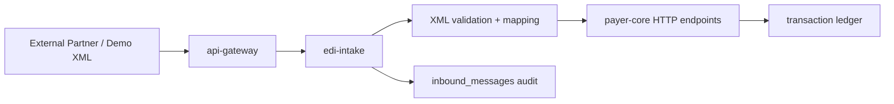

# ASHN Future Enhancements TODO

This backlog captures what ASHN already supports and the next useful build paths now that the project has moved beyond the original JSON-only simulator. The north star is to keep the project demoable while gradually moving closer to real healthcare EDI integration patterns.

## Current Foundation

ASHN now has a working EDI intake boundary that accepts canonical XML/JSON payloads plus first-pass raw X12 `837`/`275`, validates them, converts them into ASHN's internal transaction model, audits every submission, and forwards accepted work to `payer-core`.

This keeps `payer-core` focused on business state while giving us a clean place to experiment with external data formats, trading partner rules, replay, and broader raw X12 intake.

## Recommended Next Milestone

Harden ASHN from a visible simulator into a stronger integration lab: API authentication, request/correlation IDs, structured logs, basic traces, migration/seed reset tests, rate limiting, and safe document-vault receipts for external 275 references.

## Priority Backlog

### P0 — XML EDI Intake Service

- [x] Add a new `apps/edi-intake` service.
- [x] Expose `POST /x12/xml` for XML transaction submissions.
- [x] Accept `Content-Type: application/xml` and `text/xml`.
- [x] Parse XML into a neutral inbound envelope.
- [x] Detect transaction type: `834`, `270`, `275`, `278`, `837`, `276`, `835`, `820`.
- [x] Validate required fields per transaction type.
- [x] Return structured validation errors for malformed or incomplete XML.
- [x] Convert accepted XML into ASHN payer requests.
- [x] Forward accepted work to `payer-core` through internal HTTP APIs.
- [x] Add gateway route `POST /v1/x12/xml`.
- [x] Add unit tests for valid XML, invalid XML, missing fields, and unsupported transaction types.
- [x] Persist raw inbound XML for audit/debug replay.
- [x] Add DB-backed integration tests through `api-gateway → edi-intake → payer-core`.

Suggested service boundary:



Why this deserves a new service:

- XML and X12 parsing concerns are different from payer business logic.
- External payload validation should not clutter `payer-core`.
- It gives us a realistic integration boundary for partner submissions.
- It supports XML, JSON, first-pass raw X12, and can later add file drops and async queues.
- `payer-core` remains the source of truth for business rules, state transitions, transaction generation, and async jobs.

Important nuance: real X12 is often exchanged as delimiter-based EDI text rather than XML. Many enterprise systems also use XML wrappers, canonical XML, or XML-based integration contracts around EDI workflows. ASHN now uses XML/JSON for readable canonical demos and a small raw X12 parser for `837` and `275` segment intake.

## XML Intake Architecture Decisions

- **Routing:** Public submissions go through `api-gateway` at `POST /v1/x12/transactions` for content-negotiated XML/JSON intake. `POST /v1/x12/xml` remains as an XML compatibility route.
- **Business ownership:** `edi-intake` does not write payer transactions directly. It validates, maps, audits, and calls existing `payer-core` endpoints so one service owns business behavior.
- **Canonical contract:** Start with one canonical ASHN transaction envelope. XML uses `<AshnX12Transaction type="837">`; JSON uses the same shape with `type`, `sender`, `receiver`, and transaction-specific payload objects. Transaction-specific or partner-specific schemas can layer on later.
- **Audit policy:** Accepted and rejected XML submissions both create `inbound_messages` audit records. Rejections keep raw payload, error, transaction type when detectable, and downstream status when applicable.
- **Representation model:** Treat XML and JSON like Rails-style representations at the API edge: the gateway exposes one public workflow surface while intake services translate content types into canonical domain requests.

### P1 — Raw X12 Generation

- [x] Generate raw X12-like strings alongside the current JSON payloads.
- [x] Add envelope segments: `ISA`, `GS`, `ST`, `BHT`, `SE`, `GE`, `IEA`.
- [x] Add transaction-specific segment examples for `834`, `270`, `271`, `275`, `278`, `837`, `835`, `276`, and `277`.
- [x] Store raw X12 text on each ledger transaction.
- [x] Show raw X12 in the dashboard transaction detail panel.
- [x] Add copy buttons for raw transaction payloads.
- [x] Add download buttons for raw transaction payloads.
- [x] Expand segment generation toward companion-guide examples.
- [x] Add XML intake validation rules per transaction type.
- [x] Add full companion-guide validation profiles per trading partner.

### P1 — Acknowledgments

- [x] Add `999` implementation acknowledgment for accepted or rejected syntax.
- [x] Add `277CA` claim acknowledgment after `837` submission.
- [x] Track acknowledgment relationships between source transactions and responses.
- [x] Add dashboard filters for acknowledgment transaction types.
- [x] Add tests for accepted and rejected acknowledgment flows.

### P1 — Asynchronous Processing

- [x] Turn `apps/tx-worker` into an active worker service.
- [x] Add a transaction queue table or lightweight message queue.
- [x] Move long-running authorization and adjudication work off the request path.
- [x] Add retry, dead-letter, and replay behavior.
- [x] Show async status transitions in the dashboard.

### P2 — Prior Authorization Lifecycle

- [x] Add explicit `278` approval and denial endpoints.
- [x] Add authorization review state: `Pending`, `Approved`, `Denied`.
- [x] Add severity and service-type rules for auto-approval.
- [x] Link authorization decisions to downstream claims.
- [x] Show authorization history in claim detail views.

### P2 — Claim Adjudication

- [x] Add baseline adjudication rules based on severity and billed amount.
- [x] Calculate allowed amount, patient responsibility, paid amount, and denial reasons.
- [x] Add denial and partial-payment scenarios.
- [x] Expand `835` payloads with claim adjustment and remittance details.
- [x] Add tests for paid adjudication and remittance detail.
- [x] Add `275` patient information attachments linked to claim transactions.
- [x] Add payer-specific `275` companion-guide validation and timeline attachment labels.
- [x] Add solicited claim attachment requests that move claims into `Pending Documentation`.
- [x] Add a 275 Documentation Workbench for checklist requests and packet submission.
- [x] Add per-document review controls for 275 checklist packets.
- [x] Add document deficiency requests with single-document 275 resubmission.
- [x] Allow `275` attachments to link to pending `278` prior authorization reviews.
- [x] Add attachment review outcomes distinct from transaction acceptance.
- [x] Support external document references for large PDFs/images instead of embedded `BIN` content.
- [x] Add safe document-vault receipt endpoints for external `275` references and embedded content downloads.
- [x] Support multi-attachment packets grouped under a claim or authorization.
- [x] Move payer-specific `275` validation rules into trading partner profile data.
- [x] Add richer rules based on provider tier, adventurer rank, benefits, and coverage status.
- [x] Add more tests for denied and partially paid claim variants.

### P2 — Trading Partners and Routing

- [x] Add trading partner records.
- [x] Add sender/receiver identifiers distinct from internal IDs.
- [x] Add routing rules by transaction type and partner.
- [x] Add partner-specific validation profiles.
- [x] Add dashboard visibility for partner configuration.
- [x] Add create/update/delete partner management screens.
- [x] Add partner-specific companion-guide validation rules.

### P2 — Dashboard Enhancements

- [x] Add a transaction timeline view grouped by adventurer or claim.
- [x] Add saved filters for transaction type, status, provider, and date range.
- [x] Add raw payload tabs: JSON, XML, and X12.
- [x] Add XML intake audit visibility with raw XML detail.
- [x] Add transaction export to JSON, XML, and X12.
- [x] Add XML intake audit export to XML and JSON.
- [x] Add replay controls for transactions and inbound XML messages.
- [x] Add ledger export to CSV.
- [x] Add visual links between request/response transaction pairs.

### P3 — Security and Operational Readiness

- [x] Add API authentication for partner-facing endpoints.
- [x] Add request IDs and correlation IDs across services.
- [x] Add structured logs.
- [x] Add basic OpenTelemetry traces.
- [x] Add health checks for every service in Docker Compose.
- [x] Add migration tests and seed-data reset tests.
- [x] Add rate limiting for public/demo endpoints.

## Canonical XML Shape

The XML contract is intentionally simple and canonical. It does not try to mirror every real X12 segment; instead, it makes transaction intent, partner identity, validation, and audit behavior easy to inspect.

Example `837` claim submission:

```xml
<AshnX12Transaction type="837">
  <Sender id="provider-vitesse-temple" />
  <Receiver id="Adventure Society" />
  <Claim>
    <AdventurerId>adventurer-id</AdventurerId>
    <ProviderId>provider-vitesse-temple</ProviderId>
    <IncidentSeverity>Awakened</IncidentSeverity>
    <AmountCents>125000</AmountCents>
    <ServiceLine lineNumber="1">
      <ProcedureCode>ASHN1</ProcedureCode>
      <Description>Resurrection stabilization</Description>
      <Units>1</Units>
      <AmountCents>95000</AmountCents>
    </ServiceLine>
    <ServiceLine lineNumber="2">
      <ProcedureCode>ASHN2</ProcedureCode>
      <Description>Dragonfire trauma supplies</Description>
      <Units>1</Units>
      <AmountCents>30000</AmountCents>
    </ServiceLine>
  </Claim>
</AshnX12Transaction>
```

`ServiceLine` is optional for legacy/simple demos. When present, `edi-intake` forwards the lines to `payer-core`, which persists them, adjudicates allowed/paid/patient responsibility/adjustment amounts per line, rolls the totals back up to the claim, and emits line-level `835` remittance detail.

Example `270` eligibility inquiry:

```xml
<AshnX12Transaction type="270">
  <Sender id="provider-vitesse-temple" />
  <Receiver id="Adventure Society" />
  <EligibilityInquiry>
    <AdventurerId>adventurer-id</AdventurerId>
    <ProviderId>provider-vitesse-temple</ProviderId>
  </EligibilityInquiry>
</AshnX12Transaction>
```

## Suggested Next Implementation Order

1. Add API authentication for partner-facing gateway and intake endpoints.
2. Add request IDs and correlation IDs across `api-gateway`, `edi-intake`, `payer-core`, `provider-service`, and `tx-worker`.
3. Add structured logs that include transaction IDs, partner IDs, claim IDs, authorization IDs, and replay IDs.
4. Add basic OpenTelemetry traces for intake, routing, queue processing, and replay.
5. Add migration tests and seed-data reset tests for reliable demos.
6. Expand raw X12 parsing beyond the current `837`/`275` subset and add optional file-drop intake.

## Decision Summary

ASHN uses canonical XML/JSON plus first-pass raw X12 through the public gateway and a dedicated `edi-intake` service. The canonical contract stays small, strongly validated, fully audited, and easy to demo. Accepted work flows into existing `payer-core` endpoints instead of bypassing business rules. The next frontier is partner-specific variants, broader raw X12 coverage, and richer document-vault integrations.

That path gets us closer to real enterprise EDI without burying the project in full X12 implementation complexity too early.
