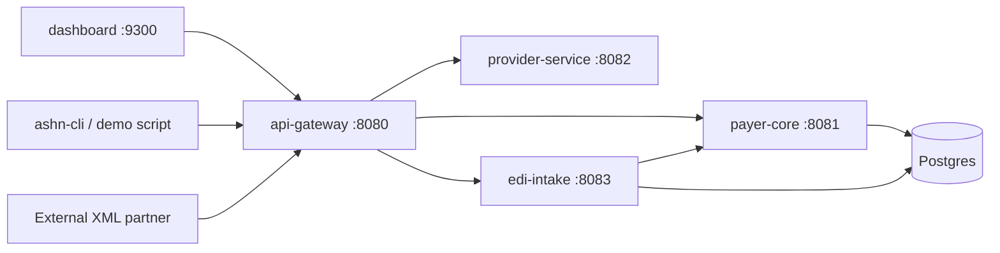
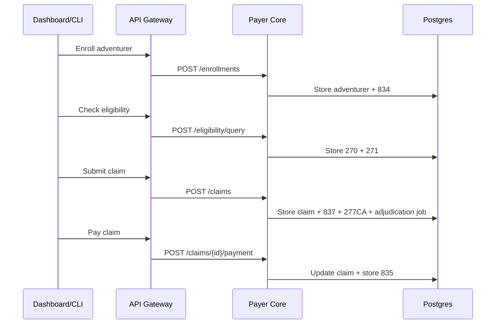
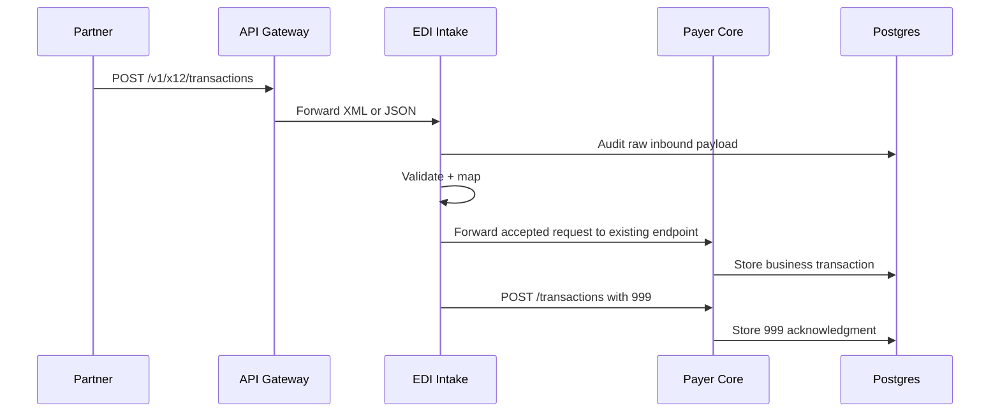

# ASHN Technical Deep Dive Presentation

Technical talk track for a 20–30 minute architecture and implementation walkthrough.

---

## Slide 1 — Technical Deep Dive

**ASHN: Adventure Society Health Network**

An EDI-inspired healthcare workflow simulator built around service boundaries, X12 transaction sequencing, XML intake, raw X12 generation, and a durable transaction ledger.

**Talk track:**  
This deep dive explains how ASHN is structured, how requests move through the system, and where the architecture is ready to grow toward more realistic EDI behavior.

---

## Slide 2 — Architecture Goals

ASHN is designed as a teaching and prototyping platform.

- Make X12 lifecycle concepts visible.
- Keep payer, provider, intake, and gateway responsibilities separate.
- Persist both business state and transaction history.
- Support repeatable demos from CLI, dashboard, and XML input.
- Leave clean seams for async work, routing, and validation.

**Talk track:**  
The core principle is separation of concerns: business workflows live in payer-core, external payload handling lives in edi-intake, and the dashboard remains a visualization layer.

---

## Slide 3 — Service Map



**Talk track:**  
The gateway is the public demo entry point. The payer service owns most business workflows. The intake service handles external XML and audit. Postgres stores durable entities and transaction history.

---

## Slide 4 — Runtime Entry Points

Common commands:

```sh
make dev-stack
make demo
make test
make test-integration
```

Dashboard:

```text
http://localhost:9300
```

Public XML intake:

```text
POST /v1/x12/xml
```

**Talk track:**  
The project is intentionally easy to run. `make dev-stack` starts the local stack and dashboard; `make demo` runs the complete workflow; `make test-integration` verifies Postgres-backed behavior.

---

## Slide 5 — Domain Model

The key entities:

- `Adventurer` — member/patient
- `Provider` — provider organization
- `Claim` — submitted encounter
- `Transaction` — EDI-style ledger event
- `InboundMessage` — raw XML intake audit record

**Talk track:**  
The important design choice is that current business state and transaction history are separate. A claim has a current status, while transactions preserve the event trail.

---

## Slide 6 — Transaction Record

Each transaction stores:

- `id`
- `type`
- `status`
- `senderId`
- `receiverId`
- `payload`
- `rawX12`
- `relatedId`
- `createdAt`

**Talk track:**  
`payload` preserves structured JSON for application use, `rawX12` supports EDI inspection and download, and `relatedId` links acknowledgments or responses back to source records.

---

## Slide 7 — X12 Coverage

Current transaction support:

| Type | Purpose |
| --- | --- |
| `834` | Enrollment |
| `270 → 271` | Eligibility inquiry and response |
| `278` | Prior authorization |
| `837 → 277CA` | Claim submission and claim acknowledgment |
| `276 → 277` | Claim status request and response |
| `835` | Payment/remittance |
| `999` | Implementation acknowledgment for XML intake |

**Talk track:**  
ASHN now covers the major demoable healthcare admin flow and includes acknowledgments, which are critical for explaining how EDI systems confirm receipt and acceptance.

---

## Slide 8 — Happy Path Sequence



**Talk track:**  
Each business action emits one or more ledger transactions. Claim submission is especially useful now because it emits both the `837` and the `277CA` acknowledgment, while preserving diagnoses, service lines, and partner-specific validation context.

---

## Slide 9 — XML Intake Flow



**Talk track:**  
The intake service owns external payload concerns, but payer-core still owns business behavior. This keeps XML and JSON handling like a Rails-style representation layer: the gateway exposes one public workflow surface, edi-intake translates canonical ASHN representations, accepted work flows into existing payer endpoints, and even rejected submissions are audited with a linked `999` acknowledgment.

---

## Slide 10 — Raw X12 Generation

ASHN generates X12-like text for every ledger transaction.

Common envelope segments:

- `ISA`
- `GS`
- `ST`
- `BHT`
- `SE`
- `GE`
- `IEA`

Transaction-specific examples include:

- `CLM`, `HI`, and `SV1` for `837`
- `NM1`, `HL`, `TRN`, `DTP`, and `REF` for eligibility and claim-status flows
- `BPR`, `TRN`, `CLP`, `SVC`, `CAS`, and `REF` for `835`
- `AK1`, `AK2`, `IK5`, `AK9` for `999`
- `TRN`, `STC` for `277CA`

**Talk track:**  
This is intentionally not full companion-guide compliance yet. It gives us inspectable raw X12 text so the team can understand envelopes, control numbers, transaction-specific loops, diagnoses, service lines, acknowledgments, and remittance math.

---

## Slide 11 — Dashboard Capabilities

The dashboard exposes the ledger as a usable demo surface.

- Workflow actions for enrollment, eligibility, auth, claims, and payment
- Transaction search and server-side filtering
- Pagination for ledger browsing
- Transaction detail panel
- Raw X12 display, copy, and download
- XML intake audit visibility
- Operational partner rejection trends with drilldown, inspect, and replay controls

**Talk track:**  
The dashboard is the bridge between business story and technical evidence. We can show a narrative workflow, then click into the exact transaction records that prove what happened. When partner intake fails, the XML Intake view now acts like an operations console: it trends rejection volume and groups failures by partner, transaction type, and validation reason so the failure pattern is obvious before we drill in, inspect, or replay a payload.

---

## Slide 12 — Persistence Strategy

Postgres stores:

- adventurers
- providers
- claims
- transactions
- enrollments
- premium payments
- authorization requests
- inbound messages

**Talk track:**  
The database lets us refresh, restart, search, filter, and run integration tests against durable state. It also moves the project from a pure mock into a credible architecture prototype.

---

## Slide 13 — Testing Strategy

Validation layers:

- Unit tests for service handlers and contract behavior
- Mock transaction generation tests
- Dashboard TypeScript production build
- Postgres-backed payer workflow integration test
- XML intake integration test through `api-gateway → edi-intake → payer-core`

**Talk track:**  
The tests focus on the paths we demo: HTTP contracts, persistence, transaction counts, raw XML audit, and acknowledgment creation.

---

## Slide 14 — Async Processing

`tx-worker` polls a Postgres-backed job queue.

- `auth_review` updates queued `278` prior authorization decisions.
- `claim_adjudication` moves submitted claims to `Pending`.
- `claim_finalization` marks claims `Approved` or `Denied`.
- Claim finalization calculates allowed, paid, adjustment, patient responsibility, and denial fields at the claim and service-line levels.
- Finalized claims emit a related `277` status transaction.
- Failed jobs can dead-letter and be replayed back to pending.
- The dashboard polls periodically so status changes and worker queue state appear over time.

**Talk track:**  
This gives the demo a more realistic shape: request handlers accept work quickly, while operational decisions happen later through an async processor.

---

## Slide 15 — What Is Simplified

ASHN is not yet a production clearinghouse.

Current simplifications:

- X12 generation is representative, not companion-guide complete.
- XML is canonical ASHN XML, not every real partner format.
- Auth, benefit, and adjudication logic is intentionally simple.
- Trading partner validation is profile-based and covers selected `275`, `278`, and `837` rules, not full companion-guide certification.
- Security and HIPAA controls are not production-ready.

**Talk track:**  
This is a feature, not a flaw. The simulator keeps the core lifecycle understandable while preserving clear seams for production-like capabilities later.

---

## Slide 16 — Next Technical Moves

Recommended next build sequence:

1. Continue expanding raw X12 parsing beyond the current demo transaction subset.
2. Add optional file-drop intake for batch/demo payloads.
3. Add richer benefit-plan rules that affect service-line adjudication.
4. Add more companion-guide variants per partner and transaction type.
5. Add operational dashboards for audit errors, retries, and partner rejection trends.
6. Add exportable demo scenarios for training and stakeholder walkthroughs.

**Talk track:**  
The next phase is about moving from integration lab to operationally understandable system: secure partner access, traceable requests, reliable demo data, and richer external-document handling.

---

## Slide 17 — Closing Architecture Summary

ASHN gives us a clean foundation:

- A memorable model for explaining healthcare EDI
- A service architecture with realistic boundaries
- A durable ledger for transaction history
- XML intake and acknowledgment behavior
- Raw X12 visibility for learning and demos
- 275 documentation workbench, per-document review, and deficiency resubmission
- Tests that protect the end-to-end workflow

**Talk track:**  
The project is now strong enough to demo to non-technical stakeholders and detailed enough to use as a technical architecture conversation starter.
