# ASHN Supported Workflows

This guide shows the workflows currently supported by Adventure Society Health Network. It is meant for demos, onboarding, and roadmap planning. The deeper transaction breakdown lives in [`x12-workflow.md`](x12-workflow.md).

## System Context

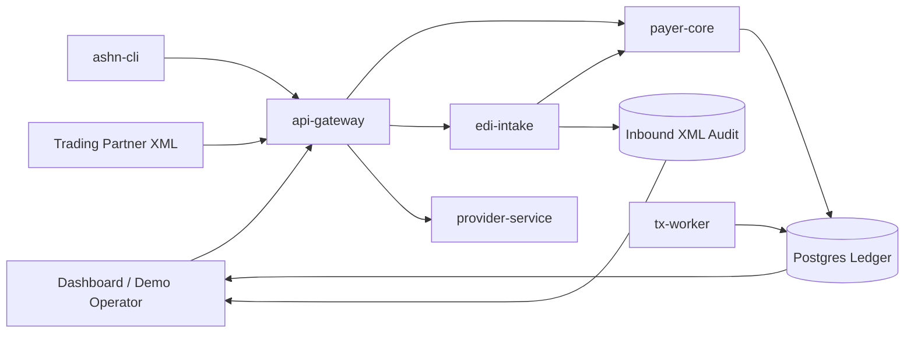

ASHN supports both **business-state APIs** and an **EDI-style transaction ledger**. A claim, authorization, or adventurer has current state, while every X12-inspired event is also persisted as a transaction record.

## Workflow Coverage Matrix

| Workflow | X12 transactions | Current entry points | Current UI support | Notes |
| --- | --- | --- | --- | --- |
| Enrollment | `834` | `POST /v1/adventurers`, XML `834` | Workflow card, ledger, timeline | Creates adventurer and enrollment transaction. |
| Eligibility | `270 → 271` | `POST /v1/eligibility`, XML `270` | Workflow card, ledger, timeline | Returns active/inactive coverage. |
| Prior authorization | `278` | `POST /v1/auth-requests`, `POST /v1/auth-requests/{id}/decision`, XML `278` | Workflow card, manual review widget, ledger, timeline | Starts pending; manual approve/deny or async worker decision. |
| Claim submission | `837 → 277CA` | `POST /v1/claims`, XML `837` | Workflow card, claims panel, ledger, timeline | Emits claim and claim acknowledgment. |
| Claim attachment | `277 → 275` | `POST /v1/claims/{id}/documentation-request`, `POST /v1/claims/{id}/attachments`, XML `275` | Claim detail action, ledger, timeline attachment label, raw X12 detail | Payer can request documentation; 275 clears the hold. |
| Claim status | `276 → 277` | `GET /v1/claims/{id}/status`, XML `276` | Ledger, timeline | Creates request/response status pair. |
| Payment/remittance | `835` | `POST /v1/claims/{id}/payment`, XML `835` | Workflow card, claims panel, ledger, detail drawer | Includes allowed, paid, adjustment, denial fields. |
| XML intake audit | `999` plus routed transaction | `POST /v1/x12/xml` | XML Intake tab, export/replay | Accepted/rejected XML submissions create audit records and acknowledgments. |
| Export/replay | JSON/XML/X12 exports | `/export`, `/replay` endpoints | Detail drawer buttons | Supports demo reset, replay, and artifact inspection. |

## 1. Enrollment Lifecycle

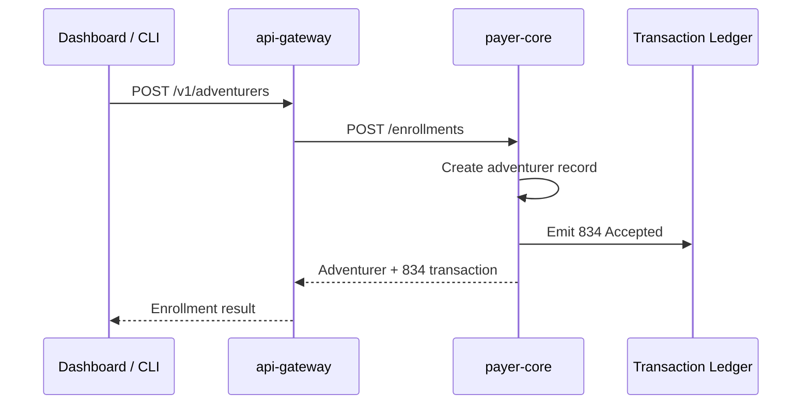

**What to show in a demo**

- Adventurer appears in the dashboard.
- Ledger contains an `834` transaction.
- Raw X12 detail includes enrollment-style segments.

## 2. Eligibility Lifecycle

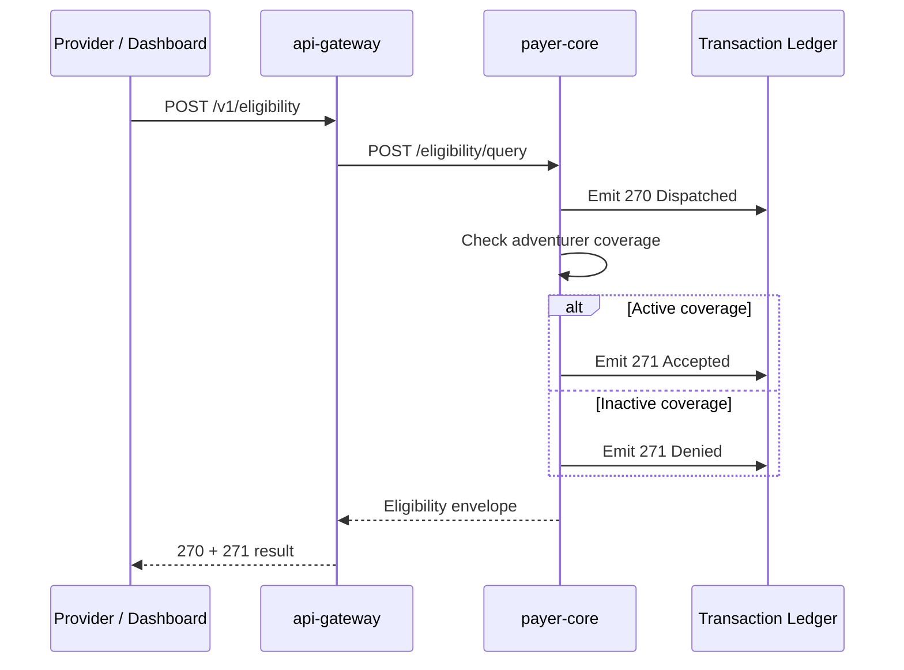

**Current behavior**

- `270` represents the inquiry.
- `271` represents the payer response.
- The response is based on the adventurer coverage status in payer-core.

## 3. Prior Authorization Lifecycle

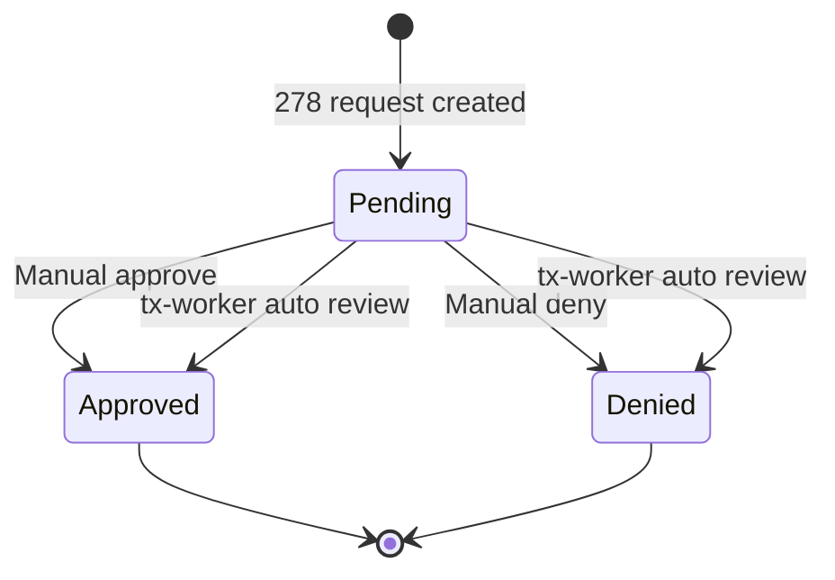

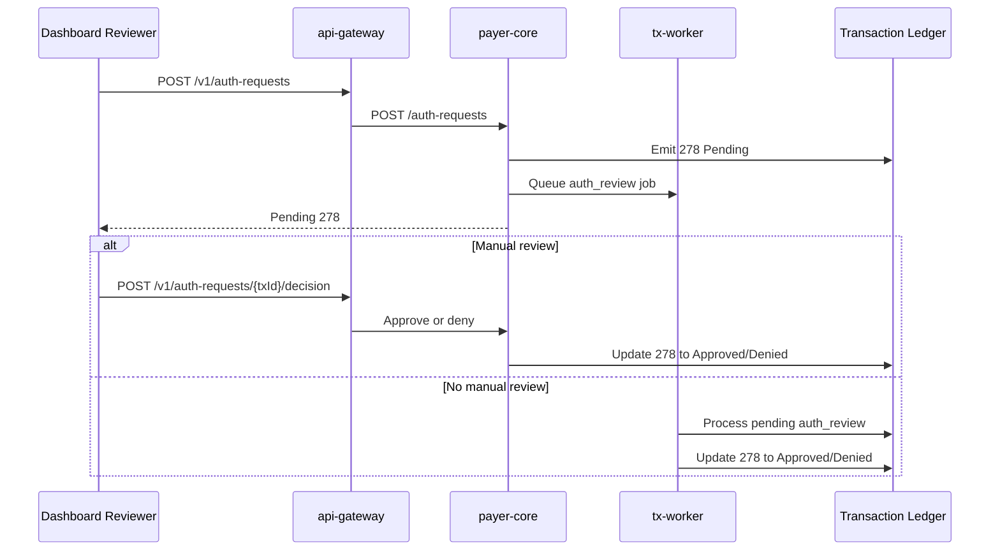

**Current behavior**

- The dashboard shows a prior-auth review widget after a `278` is created.
- `Approve Auth` and `Deny Auth` update the visible transaction status.
- The worker skips already-reviewed authorizations so manual decisions are not overwritten.

## 4. Claim Submission and Acknowledgment

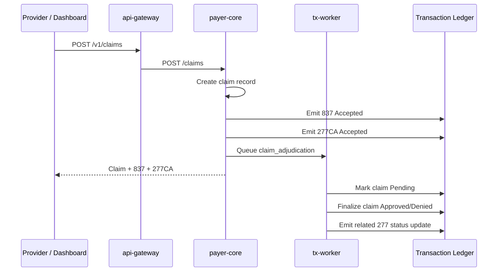

**Current behavior**

- `837` is the claim submission.
- `277CA` acknowledges that the payer accepted the claim for processing.
- `tx-worker` later adjudicates the claim.

## 5. Claim Attachment Lifecycle

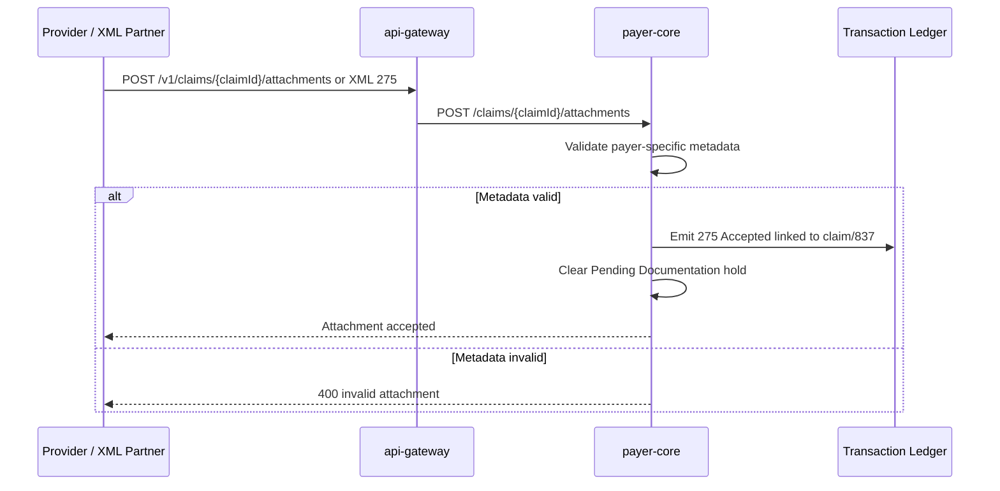

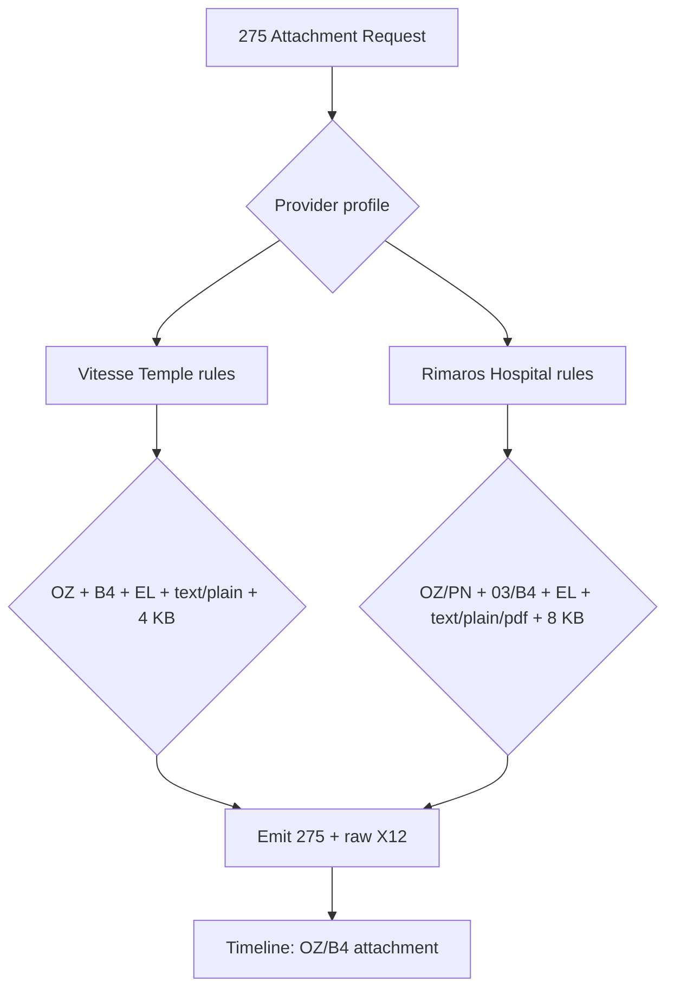

**Current behavior**

- `275` is currently claim-linked through `claimId` and `relatedId`.
- Payers can mark a claim `Pending Documentation` and emit a related `277` documentation request.
- A valid `275` clears the documentation hold back to `Pending` so adjudication can continue.
- Raw X12 includes `REF*1K`, `REF*6R`, `PWK`, `LQ*AT`, `K3`, and `BIN`.
- The timeline labels 275 steps using attachment/report metadata.

## 6. Claim Status Lifecycle

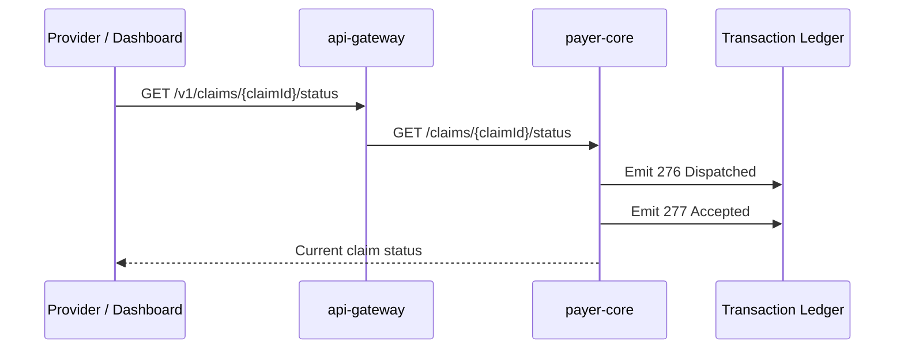

**Current behavior**

- `276` is the provider inquiry.
- `277` is the payer response.
- The dashboard timeline can group these with the related claim.

## 7. Payment and Remittance Lifecycle

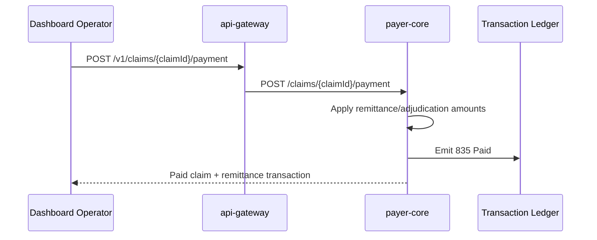

**Current behavior**

- `835` includes billed, allowed, paid, adjustment, and patient responsibility fields.
- Payment updates claim status to `Paid`.
- Raw X12 detail shows remittance-inspired segments.

## 8. XML Intake, Acknowledgment, Export, and Replay

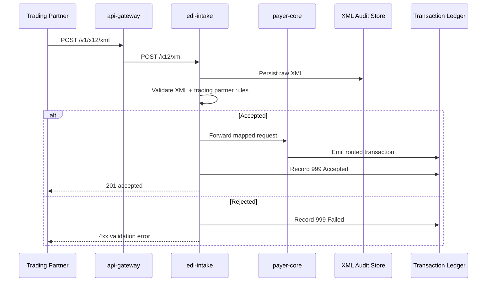

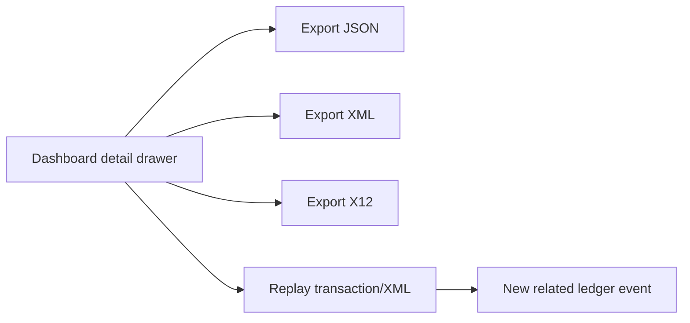

**Current behavior**

- XML intake supports canonical ASHN XML wrappers for multiple transaction types.
- Every inbound XML message is visible in the XML Intake tab.
- Transactions and XML messages can be exported and replayed for demos.

## Recommended 275 Workflows To Add Next

ASHN already supports claim-linked `275` attachments. The next high-value workflows are:

### 1. Solicited Claim Attachment Request

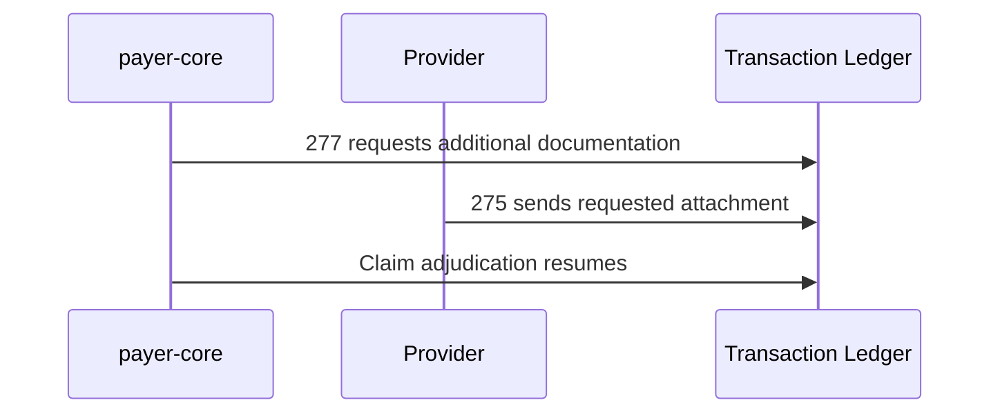

Baseline support now exists: a claim can move to `Pending Documentation`, emit a `277`, and accept a `275` that clears the hold. The next iteration should make the request reason/code more structured and show the request as a first-class attachment task.

### 2. Prior Authorization Attachment

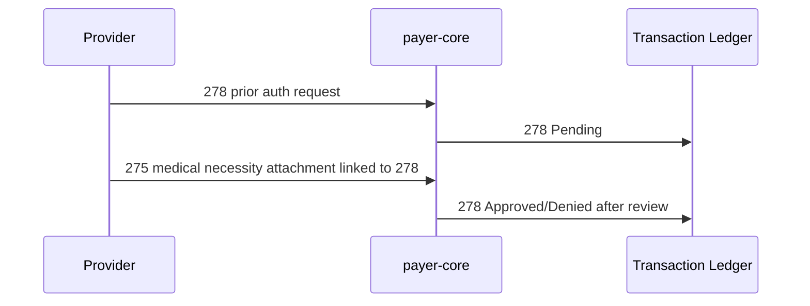

Allow `275` to link to a `278` transaction, not just a claim/`837`. This would make resurrection medical necessity feel more realistic.

### 3. Attachment Review Outcomes

Track attachment review state separately from transaction acceptance:

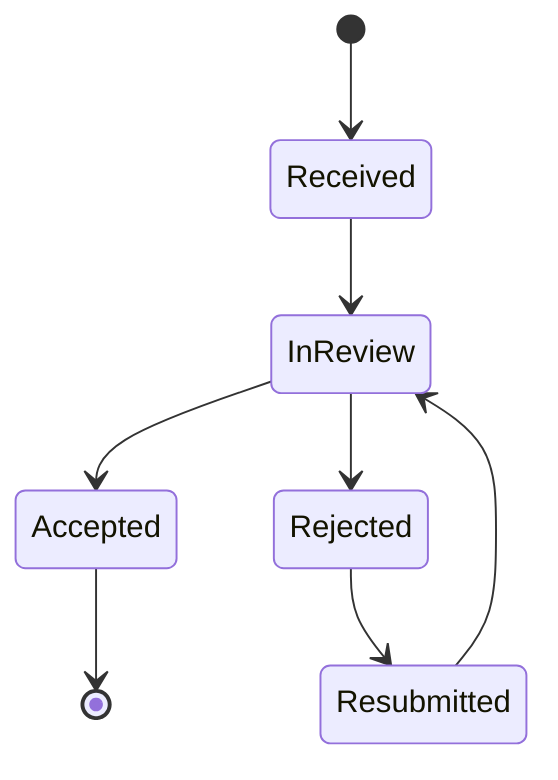

A `275` can be syntactically accepted but clinically rejected as insufficient. That distinction is useful for teaching EDI vs business decisions.

### 4. External Document Reference Mode

Support attachments that reference external documents instead of embedding content in `BIN`:

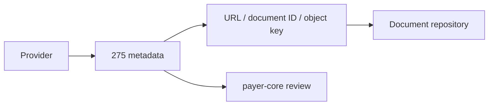

This would model common enterprise patterns where large PDFs/images are stored elsewhere and the EDI transaction carries metadata plus a retrieval pointer.

### 5. Multi-Attachment Bundles

Allow one claim or auth to receive multiple attachment documents:

- operative note
- discharge summary
- lab report
- itemized bill
- medical necessity letter

The dashboard could show a compact “attachment packet” timeline grouped under the claim or authorization.

### 6. Payer-Specific Attachment Matrix

Move the current hardcoded rules into trading partner/profile data:

- allowed attachment types
- allowed report type codes
- max content size
- accepted content types
- required control prefixes
- solicited vs unsolicited rules

This is the cleanest next architecture step if ASHN keeps leaning into companion-guide learning.
