# ASHN Supported Workflows

This guide shows the workflows currently supported by Adventure Society Health Network. It is meant for demos, onboarding, and roadmap planning. The deeper transaction breakdown lives in [`x12-workflow.md`](x12-workflow.md).

## System Context

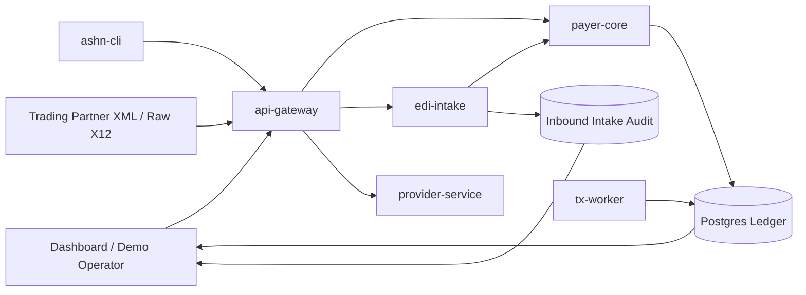

ASHN supports both **business-state APIs** and an **EDI-style transaction ledger**. A claim, authorization, or adventurer has current state, while every X12-inspired event is also persisted as a transaction record.

## Workflow Coverage Matrix

| Workflow | X12 transactions | Current entry points | Current UI support | Notes |
| --- | --- | --- | --- | --- |
| Enrollment | `834` | `POST /v1/adventurers`, XML `834`, raw X12 `834` | Workflow card, ledger, timeline, raw X12 form | Creates adventurer and enrollment transaction. |
| Premium payment | `820` | `POST /v1/premium-payments`, XML `820`, raw X12 `820` | Workflow card, ledger, timeline, raw X12 form | Records sponsor/member premium dues; recent accepted payments influence claim adjudication. |
| Eligibility | `270 → 271` | `POST /v1/eligibility`, XML `270`, raw X12 `270` | Workflow card, ledger, timeline | Returns active/inactive coverage. |
| Prior authorization | `278 → 275` | `POST /v1/auth-requests`, `POST /v1/auth-requests/{id}/attachments`, `POST /v1/auth-requests/{id}/decision`, XML `278`, raw X12 `278`, XML `275` | Workflow card, auth documentation workbench, manual review widget, ledger, timeline, raw X12 form | Starts pending; supporting 275 documentation can attach and be reviewed before manual/worker decision. |
| Claim submission | `837 → 277CA` | `POST /v1/claims`, XML `837`, raw X12 `837` | Workflow card, claims panel, ledger, timeline | Emits claim and claim acknowledgment. |
| Claim attachment | `277 → 275` | `POST /v1/claims/{id}/documentation-request`, `POST /v1/claims/{id}/attachments`, XML `275`, raw X12 `275` | Claim detail action, ledger, timeline attachment label, raw X12 detail | Payer can request documentation; 275 clears the hold. |
| Claim status | `276 → 277` | `GET /v1/claims/{id}/status`, XML `276`, raw X12 `276` | Ledger, timeline, raw X12 form | Creates request/response status pair. |
| Payment/remittance | `835` | `POST /v1/claims/{id}/payment`, XML `835`, raw X12 `835` | Workflow card, claims panel, ledger, detail drawer, raw X12 form | Includes allowed, paid, adjustment, denial fields, with premium-current context from accepted `820`s. |
| Intake audit | `999` plus routed transaction | `POST /v1/x12/xml`, `POST /v1/x12/transactions`, `POST /v1/x12/raw` | XML Intake tab, raw X12 form, export/replay | Accepted/rejected XML, JSON, and raw X12 submissions create audit records and acknowledgments. |
| Trading partner management | Routing profiles | `GET/POST/PUT/DELETE /v1/x12/trading-partners` | Partners tab create/update/delete form | Manages sender/receiver IDs, allowed X12 types, status, and route target. |
| Export/replay | JSON/XML/X12 exports | `/export`, `/replay` endpoints | Detail drawer buttons | Supports demo reset, replay, and artifact inspection. |

## Out-of-Scope X12 Sets

ASHN intentionally focuses on healthcare payer/provider workflows, primarily the X12N-style transactions shown in the coverage matrix. Some valid X12 transaction sets are outside that scope and are not currently parsed, generated, routed, or shown in the dashboard.

| Transaction set | Common domain | Meaning | ASHN status |
| --- | --- | --- | --- |
| `101` | General business / supply chain | Name and Address Lists | Not supported; cross-industry exploration candidate. |
| `110` | Transportation | Air Freight Details and Invoice | Not supported; cross-industry exploration candidate. |
| `201` | Finance / mortgage | Residential Loan Application | Not supported; outside the healthcare simulator scope. |
| `210` | Transportation | Motor Carrier Freight Details and Invoice | Not supported; outside the healthcare simulator scope. |
| `215` | Transportation | Motor Carrier Pickup Manifest | Not supported; outside the healthcare simulator scope. |

If ASHN ever grows into a cross-industry EDI lab, these would belong in a separate module with their own partner profiles, raw segment examples, validation rules, and demo workflows rather than inside the healthcare claim lifecycle.

## Planned Healthcare Workflow Expansions

These stay inside ASHN's payer/provider learning mission and are good candidates for future workflow cards, raw X12 samples, partner validation profiles, and E2E tests.

| Expansion | X12 transactions | Why it belongs |
| --- | --- | --- |
| Dental eligibility detail | `270 → 271` | Returns dental service-type benefits with annual maximum, remaining maximum, coverage percentages, waiting period, and frequency limits. |
| Dental prior authorization / predetermination | `278` | Supports a first dental predetermination slice with CDT/tooth/surface/quadrant fields; richer dental review rules remain future work. |
| Dental claim submission | `837D → 277CA` | Submits CDT-coded dental claims with tooth, surface, quadrant, and orthodontic indicators while preserving acknowledgment flow. |
| Dental attachments | `275` | Models x-rays, perio charts, narratives, orthodontic records, tooth/quadrant support, and solicited attachment traceability. |
| Dental remittance | `835` | Shows CDT/service-line payment, patient responsibility, adjustments, and denial reasons for dental procedures. |

## 1. Enrollment Lifecycle

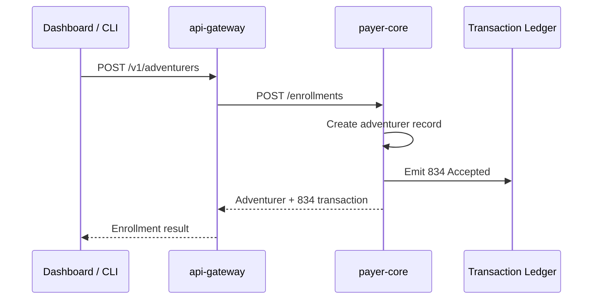

**What to show in a demo**

- Adventurer appears in the dashboard.
- Ledger contains an `834` transaction.
- Raw X12 detail includes enrollment-style segments.

## 2. Eligibility Lifecycle

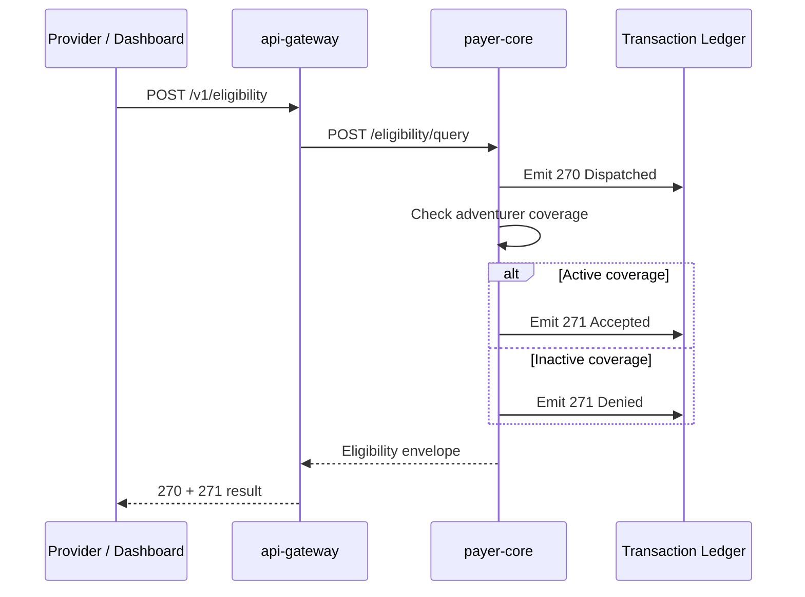

**Current behavior**

- `270` represents the inquiry.
- `271` represents the payer response.
- The response is based on the adventurer coverage status in payer-core.

## 3. Prior Authorization Lifecycle

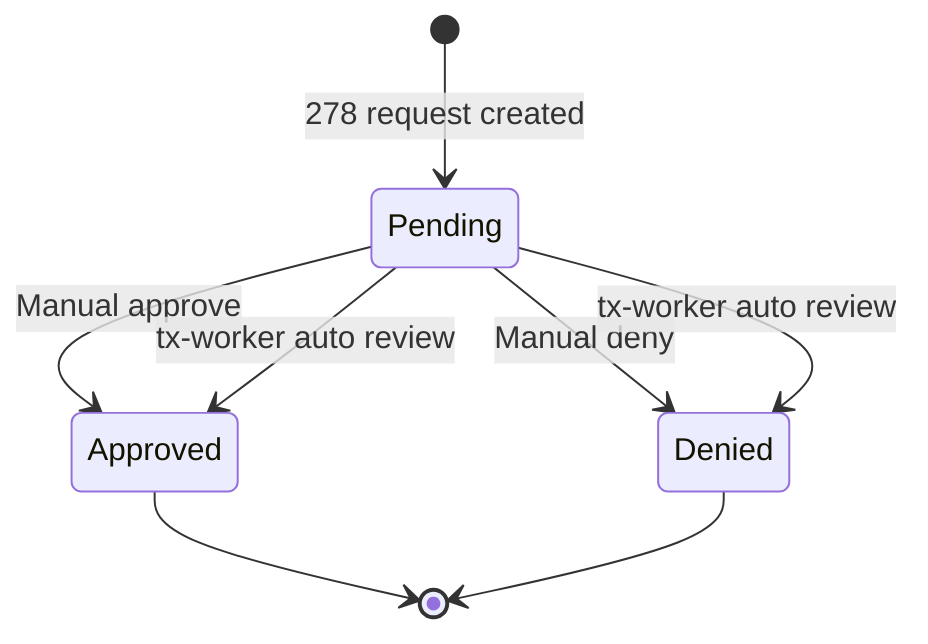

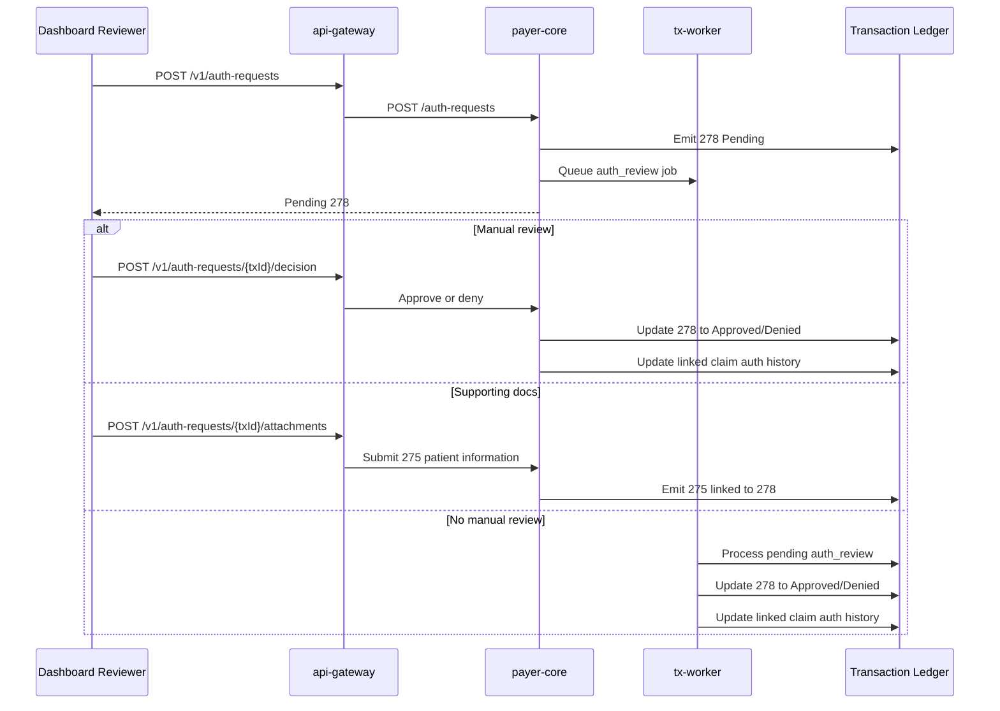

**Current behavior**

- The dashboard shows a prior-auth review widget after a `278` is created.
- `Send 275 Auth Docs` emits a related `275` for supporting medical necessity documentation.
- `Approve Auth` and `Deny Auth` update the visible transaction status.
- The async worker auto-approves Diamond resurrection requests and auto-denies requests outside the configured severity/service-type rule.
- The worker skips already-reviewed authorizations so manual decisions are not overwritten.
- Claims can reference an authorization transaction, preserve the authorization status/reason, and display that history in the claim detail drawer.
- Approved authorization allows otherwise catastrophic Diamond claims to adjudicate instead of denying for missing prior authorization.

## Async Processing Visibility

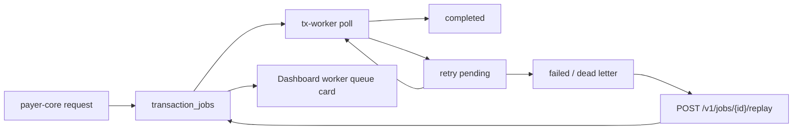

- `GET /v1/jobs` exposes recent async jobs with type, entity, status, attempts, run time, error, and dead-letter flag.
- `POST /v1/jobs/{id}/replay` resets failed jobs back to pending with attempts cleared.
- The dashboard polls the queue next to live session events so users can see queued, completed, failed, and replayable work.

## 4. Claim Submission and Acknowledgment

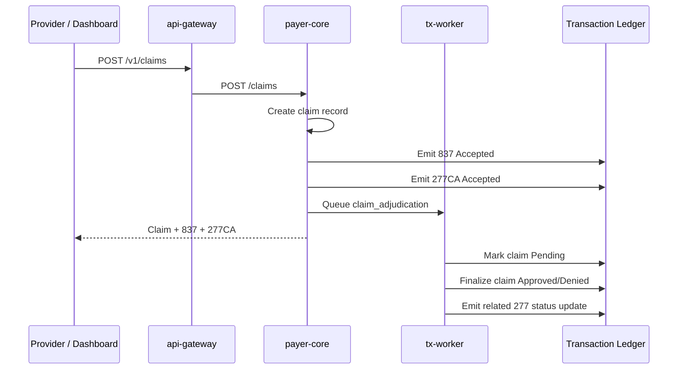

**Current behavior**

- `837` is the claim submission.
- `277CA` acknowledges that the payer accepted the claim for processing.
- `tx-worker` later adjudicates the claim using severity, diagnoses, billed amount, service lines, prior authorization, provider tier, adventurer rank, and coverage status.
- XML/JSON `837` intake can include canonical `Diagnosis` and `ServiceLine` entries, and raw X12 `837` intake maps `HI` plus each `SV1` into the same claim model.
- Higher-tier providers and higher-rank adventurers can improve paid/allowed outcomes; pending coverage reduces payment, while inactive or suspended coverage denies the claim.

## 5. Claim Attachment Lifecycle

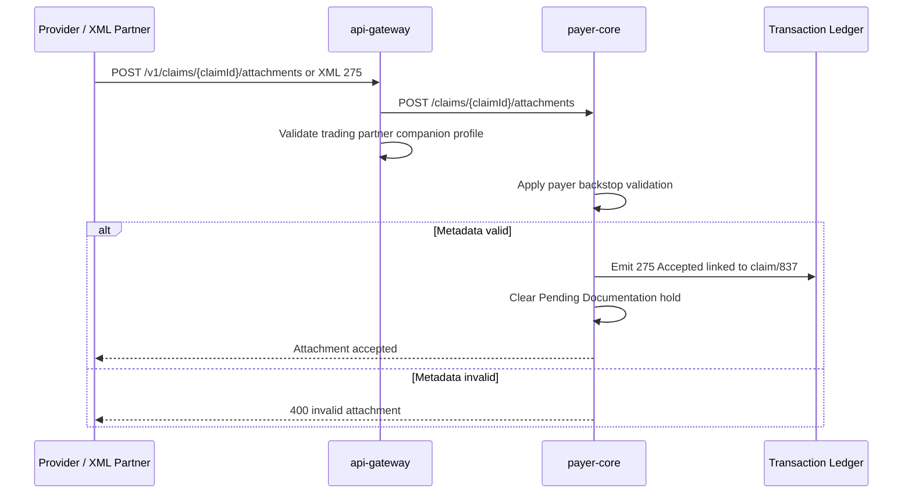

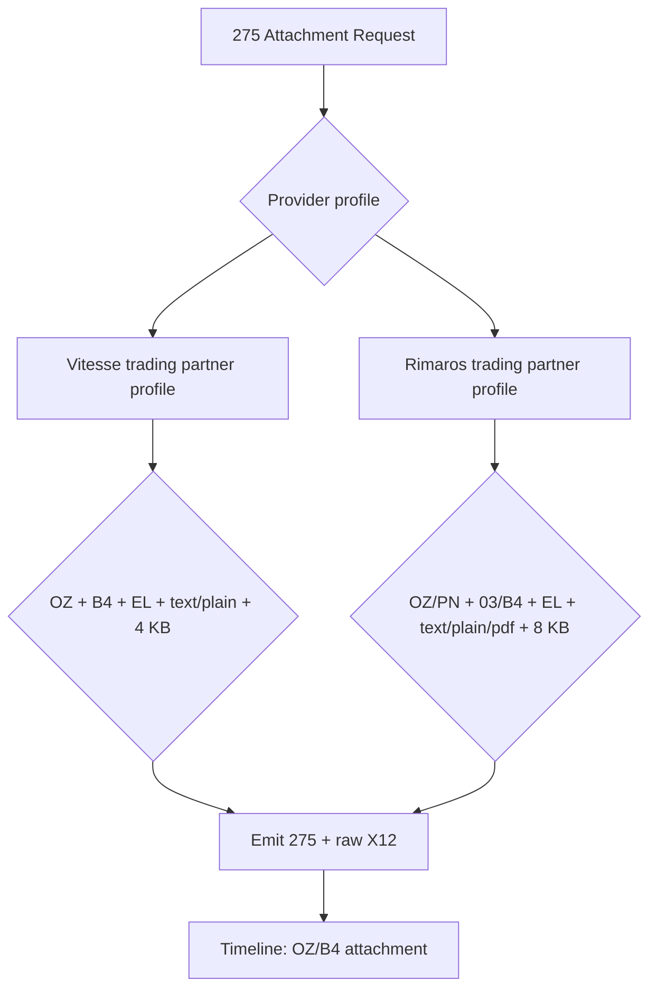

**Current behavior**

- `275` can be claim-linked through `claimId` or prior-auth-linked through `authorizationTransactionId`.
- Payers can mark a claim `Pending Documentation` and emit a related `277` documentation request with a due date and checklist.
- The claim detail drawer includes a 275 Documentation Workbench for requesting checklist items, submitting a multi-document packet, reviewing each document independently, and resubmitting only deficient documents.
- A valid `275` clears the documentation hold back to `Pending` so adjudication can continue.
- The `275` transaction remains EDI `Accepted`, while `attachmentReviewStatus` tracks business review as `Received`, `Accepted`, or `Rejected`.
- Attachments can embed content or reference external documents through `documentReferenceId` and `documentReferenceUrl`.
- `GET /v1/transactions/{id}/document-reference` exposes a safe 275 vault receipt; embedded content can be downloaded from `/document-reference/content`.
- Multi-attachment packets can submit repeated supporting documents as separate `275` transactions sharing `packetId`, `packetSequence`, and `packetCount`.
- `edi-intake` rejects partner profile violations before forwarding, including unsupported attachment/report/content codes, bad control-number prefixes, oversized embedded content, and unsupported `278` service/severity values.
- The dashboard Partners tab shows each profile as a compact companion-guide matrix for `275` attachment rules, `278` authorization service/severity rules, and `837` diagnosis/procedure rules.
- Raw X12 includes claim `REF*1K` or authorization `REF*G1`, packet `REF*F8`, plus `REF*6R`, `PWK`, `LQ*AT`, `K3`, and optional `BIN`.
- The timeline labels 275 steps using attachment/report metadata and review status, and transaction detail exposes request/response links plus JSON, XML, and X12 payload tabs for demos and debugging.

## 6. Claim Status Lifecycle

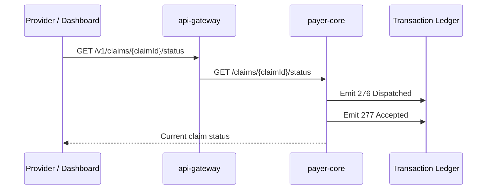

**Current behavior**

- `276` is the provider inquiry.
- `277` is the payer response.
- The dashboard timeline can group these with the related claim.

## 7. Payment and Remittance Lifecycle

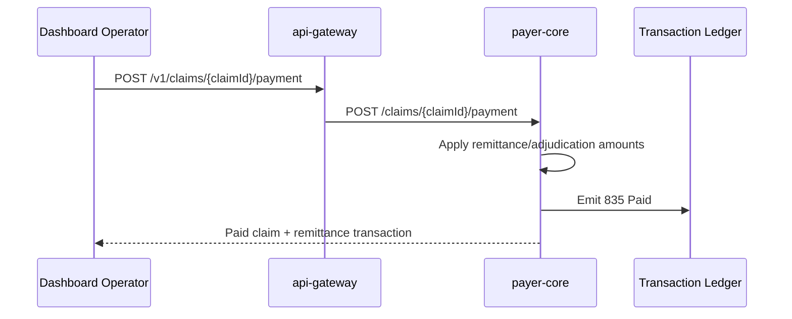

**Current behavior**

- `835` includes billed, allowed, paid, adjustment, and patient responsibility fields.
- Payment updates claim status to `Paid`.
- Transaction detail shows request/response links plus JSON, XML, and raw X12 payload tabs with remittance-inspired X12 segments, and the loaded transaction ledger can be exported as CSV.

## 8. XML Intake, Acknowledgment, Export, and Replay

ASHN treats XML and JSON as external representations, not separate business pathways. The public API accepts canonical transaction payloads through `api-gateway`, `edi-intake` translates and audits them, and `payer-core` still owns business validation, transaction persistence, authorization lifecycle, claims, payments, and async jobs.

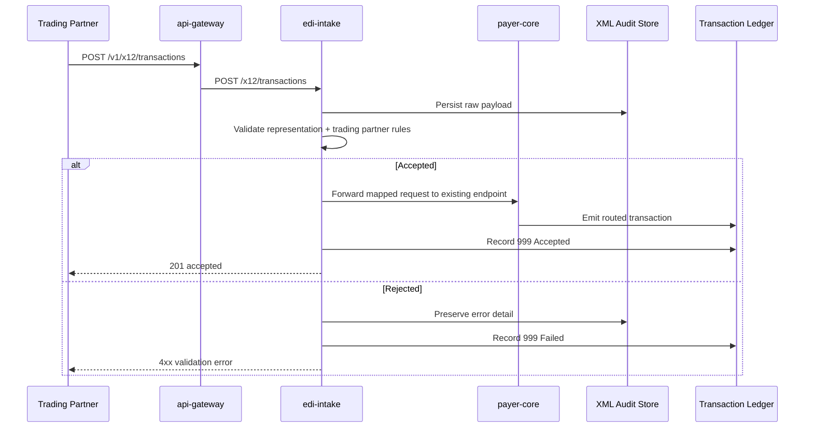

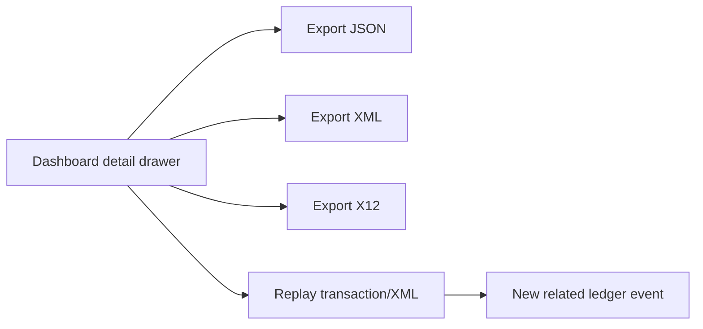

**Current behavior**

- Intake supports canonical ASHN XML and JSON wrappers for multiple transaction types.
- Canonical ASHN XML is the first supported contract; transaction-specific and partner-specific XML can be added later.
- XML intake calls existing `payer-core` endpoints instead of writing payer transactions directly.
- `POST /v1/x12/transactions` is the content-negotiated public route; `POST /v1/x12/xml` remains as an XML compatibility route.
- `POST /v1/x12/batch` accepts multipart `files` uploads for XML, JSON, EDI, or X12 demo batches and processes each file through the same audited intake path.
- Every inbound representation is visible in the XML Intake tab.
- Accepted and rejected submissions create audit records.
- Transactions and intake messages can be exported and replayed for demos.
- Rejected partner submissions are summarized in an operational audit console by partner, transaction type, validation reason, and day-level trend, so profile failures can be drilled into, inspected, or replayed without scrolling the full audit list.

## Recommended 275 Expansion Paths

ASHN already supports claim-linked `275` attachments, solicited claim documentation, a documentation workbench, and prior-auth-linked 275 attachments. The next high-value expansion paths are:

### 1. Solicited Claim Attachment Request

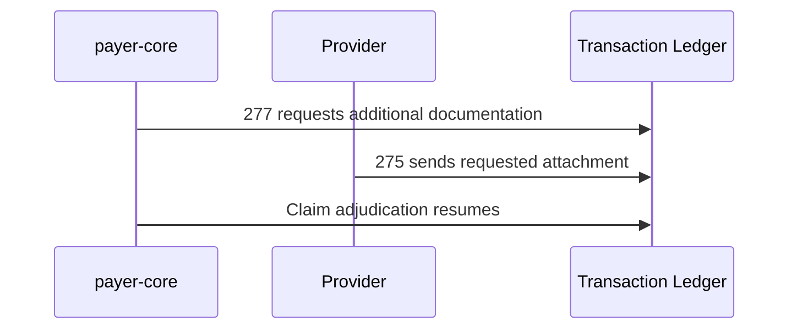

Baseline support now exists: a claim can move to `Pending Documentation`, emit a `277` with checklist metadata, and accept a multi-document `275` packet that clears the hold. The dashboard shows the request as a first-class 275 Documentation Workbench task with per-document review controls and single-document deficiency resubmission.

### 2. Prior Authorization Attachment

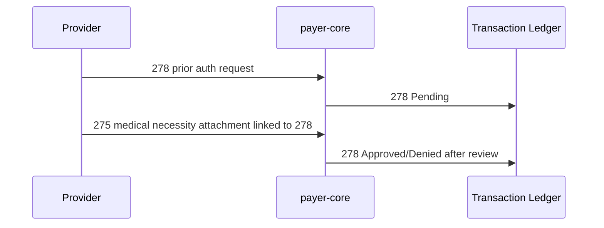

Baseline support now exists: the dashboard and APIs can emit one `275` or a packet of `275` documents linked to a pending `278`, the auth workbench shows expected medical-necessity documents, and attachment review state is tracked separately from final authorization decision state.

### 3. Attachment Review Outcomes

Baseline support now exists through `POST /v1/transactions/{id}/attachment-review` and the dashboard transaction detail drawer. Track attachment review state separately from transaction acceptance:

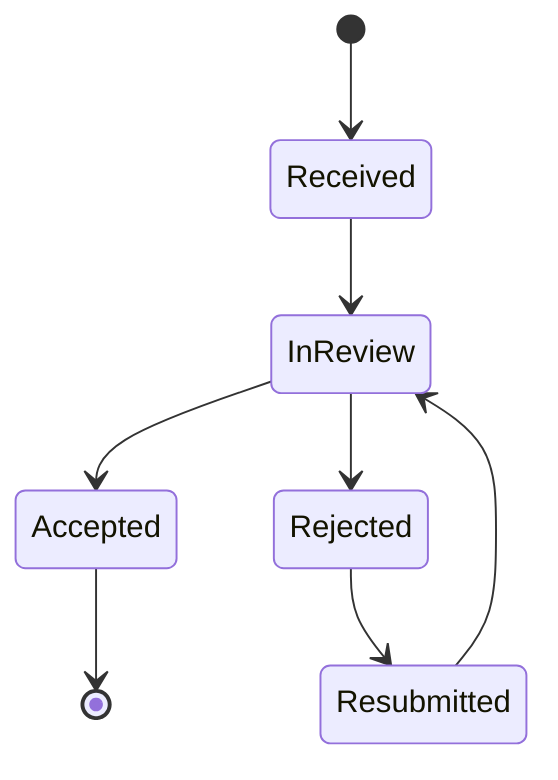

A `275` can be syntactically accepted but clinically rejected as insufficient. That distinction is useful for teaching EDI vs business decisions.

### 4. External Document Reference Mode

Baseline support now exists. Attachments can reference external documents instead of embedding content in `BIN`, and ASHN exposes safe vault receipt metadata without fetching arbitrary external URLs:

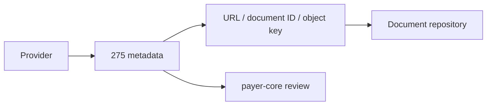

This models common enterprise patterns where large PDFs/images are stored elsewhere and the EDI transaction carries metadata plus a retrieval pointer. The dashboard transaction drawer can inspect the vault receipt, and embedded-content attachments can be downloaded directly.

### 5. Multi-Attachment Bundles

Baseline support now exists through checklist packets and deficiency resubmission. Continue expanding one claim or auth receiving multiple attachment documents:

- operative note
- discharge summary
- lab report
- itemized bill
- medical necessity letter

The dashboard could show a compact “attachment packet” timeline grouped under the claim or authorization.

### 6. Payer-Specific Attachment Matrix

Baseline support now exists through partner-specific companion-guide validation rules. Continue expanding trading partner/profile data:

- allowed attachment types
- allowed report type codes
- allowed diagnosis qualifiers/codes
- allowed procedure codes/prefixes
- max content size
- accepted content types
- required control prefixes
- solicited vs unsolicited rules
- dashboard guide matrices for partner-specific `275`, `278`, and `837` constraints

This is the cleanest next architecture step if ASHN keeps leaning into companion-guide learning.
