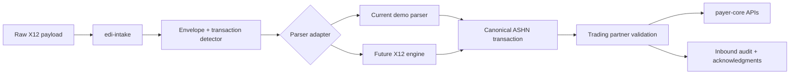

# X12 Parser Strategy

ASHN currently uses a deliberately small raw X12 parser inside `edi-intake`. It reads enough delimiter-based segments to teach the healthcare workflow, audit inbound submissions, generate acknowledgments, and map accepted transactions into the canonical payer APIs.

This is the right foundation for a learning/demo project. It is not enough for clearinghouse-grade validation.

## Current Parser Role

The current parser is responsible for:

- detecting transaction type from `ST01`
- reading envelope identity from `ISA`, `GS`, and `NM1` segments
- extracting canonical ASHN fields from supported demo loops
- applying trading partner profile rules before forwarding
- creating `999`, `824`, or `TA1`-style outcomes for demoable rejection paths
- preserving raw inbound payloads for audit, export, and replay

It intentionally does not try to enforce every implementation-guide situational rule, hierarchical loop constraint, balancing rule, code-list variant, payer companion-guide exception, or certification scenario.

## Why Not Keep Extending the Demo Parser Forever?

The demo parser is fast to understand and easy to modify, but every new transaction set adds hidden complexity:

- **Loop context:** Real X12 meaning depends on where a segment appears, not only the segment identifier.
- **Repeating structures:** Claims, service lines, attachments, adjustments, diagnoses, and remarks can repeat with transaction-specific limits.
- **Situational rules:** Many fields are required only when another qualifier or partner rule is present.
- **Acknowledgment fidelity:** Accurate `TA1`, `999`, `277CA`, and `824` outcomes require knowing whether the failure is interchange, syntax, implementation, application, or business-review related.
- **Partner variance:** Companion guides frequently narrow or reinterpret implementation-guide behavior.
- **Certification burden:** A parser that “usually works” is not the same thing as a parser that passes clearinghouse or payer certification.

The practical risk is that the parser becomes a pile of segment heuristics that looks realistic in demos but becomes harder to trust as a test harness.

## Recommended Direction

Keep the current parser as an **educational adapter** and introduce a parser boundary before adding certification-grade behavior.



The adapter should expose one internal result shape:

- parsed transaction type
- sender and receiver identifiers
- interchange, group, and transaction control numbers
- canonical ASHN payload candidate
- parser warnings
- parser errors with segment/element context
- acknowledgment classification hint: `TA1`, `999`, `824`, or business review

That lets ASHN swap implementation details without rewriting gateway routes, dashboard replay, audit storage, or payer-core workflow logic.

## Build vs. Integrate Decision

### Keep Building In-House When

- the goal is teaching and visual demos
- the transaction set is already in ASHN's workflow map
- fixtures are small and intentionally curated
- validation rules are partner-profile rules rather than full implementation-guide rules
- the output is a canonical ASHN request, not a legally reliable EDI artifact

### Integrate or Build a Real Engine When

- the goal shifts toward production-like interchange handling
- users need full loop/context validation
- failures must identify exact segment, element, and implementation-rule references
- transaction balancing matters, such as claim/service-line totals or remittance balancing
- multiple companion guides need to run side by side
- certification test decks become a target
- ASHN starts accepting arbitrary partner files rather than curated demo samples

## Suggested Parser Boundary

Add a package-level contract before adding more raw transaction sets:

```go
type X12ParseResult struct {
    TransactionType string
    SenderID        string
    ReceiverID      string
    InterchangeID   string
    GroupID         string
    TransactionID   string
    Canonical       inboundTransaction
    Warnings        []X12ParseIssue
    Errors          []X12ParseIssue
    AckHint         string
}

type X12ParseIssue struct {
    Severity string
    Segment  string
    Element  string
    Code     string
    Message  string
}
```

`edi-intake` should depend on this result, not on scattered segment-map helpers. The current parser can become the first adapter behind that contract.

## Migration Plan

1. **Wrap current parsing:** Move raw parser helpers behind a small `x12parser` package or interface.
2. **Return structured issues:** Replace plain parser errors with issue lists that preserve segment and qualifier context.
3. **Keep canonical mapping separate:** Parse X12 structure first, then map into ASHN's canonical request model.
4. **Add fixture packs:** Store accepted/rejected fixture sets by transaction type and partner profile.
5. **Add parser conformance tests:** Assert transaction type, sender/receiver, control numbers, canonical payload, and acknowledgment hint.
6. **Evaluate engine integration:** Only after the boundary exists, compare using a real parser/validator engine behind the same interface.

## Near-Term ASHN Choice

For this project phase, ASHN should not chase clearinghouse certification. The best next move is to **keep the current demo parser**, document its limits, and add the adapter boundary when raw X12 coverage expands again.

That keeps the project useful as a learning system while avoiding the architectural trap of pretending a handcrafted parser is a full EDI compliance engine.
