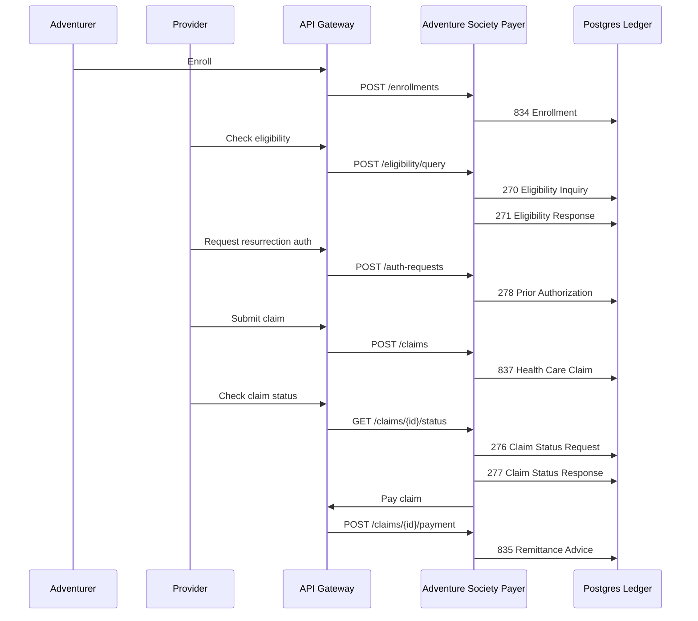

# ASHN X12 Workflow Breakdown

ASHN uses X12 healthcare transactions as the backbone of a fantasy healthcare demo. The project is not a full X12 parser or clearinghouse; it is an EDI-inspired simulator that makes the transaction lifecycle visible through services, API calls, persisted ledger records, and a dashboard.

The useful mental model is:

- **Adventure Society** = payer / health plan
- **Adventurer** = covered member / patient
- **Temple, clinic, or outpost** = provider
- **Dungeon injury or resurrection need** = medical event
- **Transaction ledger** = durable EDI event history

## Why X12 Matters Here

X12 is the family of standardized EDI transactions used by US healthcare organizations to exchange administrative information. In the real world, these messages move between providers, payers, clearinghouses, employers, and banks.

ASHN translates those ideas into a small working system:

- the dashboard and CLI trigger business actions
- the API gateway routes requests to payer and provider services
- the payer service creates EDI-inspired `Transaction` records
- each transaction captures type, status, sender, receiver, payload, and timestamp
- Postgres stores the transaction ledger for search, filtering, and replayable demos

## End-to-End Flow



## Transaction Map

| X12 | Real-world purpose | ASHN story version | Current status behavior |
| --- | --- | --- | --- |
| `834` | Benefit enrollment and maintenance | Adventurer joins the Adventure Society plan | `Accepted` |
| `820` | Premium payment | Adventurer or sponsor pays premium dues | `Accepted`; available in the mock generator |
| `270` | Eligibility inquiry | Provider asks whether the adventurer has active coverage | `Dispatched` |
| `271` | Eligibility response | Society confirms or denies active coverage | `Accepted` when active, otherwise `Denied` |
| `278` | Prior authorization | Provider requests approval for high-severity care such as resurrection | `Pending` by default |
| `837` | Health care claim | Provider submits a claim for the encounter | `Accepted` |
| `835` | Claim payment / remittance advice | Society pays the provider and explains the remittance | `Paid` |
| `276` | Claim status request | Provider asks for the current state of a claim | `Dispatched` |
| `277` | Claim status response | Society returns the claim’s current status | `Accepted` |
| `269` | Health care benefit coordination | Reserved in the domain model for future coordination workflows | Not yet emitted |

## How Each Step Works

### 1. Enrollment: `834`

When a user enrolls an adventurer, ASHN creates an adventurer record and emits an `834 Benefit Enrollment and Maintenance` transaction.

This represents the moment a member becomes known to the plan. The payload includes the adventurer profile, sponsor, and lore summary. The transaction sender is the adventurer ID and the receiver is the Society.

### 2. Eligibility: `270 → 271`

Before treatment, a provider checks whether the adventurer is covered.

- `270 Eligibility Inquiry` is the provider asking the payer for coverage information.
- `271 Eligibility Response` is the payer answering with eligibility and coverage status.

In ASHN, active coverage returns an accepted `271`; inactive or unavailable coverage returns a denied-style response.

### 3. Prior Authorization: `278`

Some services need approval before they happen or before they are reimbursed. ASHN models this with resurrection care because it is memorable and clearly high-stakes.

The `278 Prior Authorization Request` payload includes:

- adventurer ID
- provider ID
- requested service type
- lore summary

The request is initially `Pending`, which gives the demo room to later grow into approval, denial, review queues, or async adjudication.

### 4. Claim Submission: `837`

After the encounter, the provider submits an `837 Health Care Claim`.

In ASHN, the claim includes:

- adventurer ID
- provider ID
- incident severity
- claim amount
- claim status
- linked transaction ID

The mock payload also adds a severity description so the fantasy event maps back to the claim type: normal wounds, awakened-tier injuries, or diamond-tier catastrophic cases.

### 5. Claim Status: `276 → 277`

A provider can ask what happened to a claim after submission.

- `276 Claim Status Request` asks for the status of a specific claim.
- `277 Claim Status Response` returns the current status from the payer ledger.

This pair is useful in demos because it shows that EDI is not just a one-way submission path. Providers often need follow-up transactions after the original claim.

### 6. Payment and Remittance: `835`

When a claim is paid, ASHN updates the claim status and emits an `835 Claim Payment / Remittance Advice`.

The `835` represents the payer saying: “Here is what we paid, for which claim, and to whom.” In the dashboard, this is the final satisfying ledger event: the healer gets paid and the claim reaches `Paid`.

## ASHN Transaction Record Shape

Every emitted X12-inspired event becomes a `Transaction` record:

```json
{
  "id": "transaction-id",
  "type": "837",
  "status": "Accepted",
  "senderId": "provider-vitesse-temple",
  "receiverId": "Adventure Society",
  "payload": {
    "x12": "837 Health Care Claim",
    "claim": {
      "id": "claim-id",
      "adventurerId": "adventurer-id",
      "providerId": "provider-vitesse-temple",
      "incidentSeverity": "Awakened",
      "amountCents": 125000,
      "status": "Submitted"
    }
  },
  "createdAt": "2026-06-29T16:00:00Z"
}
```

The important architectural choice is that ASHN stores normalized business entities, such as adventurers and claims, while also storing the transaction ledger. That lets the app answer two different questions:

- **Current state:** What is this claim’s status right now?
- **Event history:** Which X12-style messages moved through the system?

## Service Responsibilities

| Service | Responsibility |
| --- | --- |
| `api-gateway` | Public demo API, routing, CORS, health aggregation |
| `payer-core` | Enrollment, eligibility, authorization, claims, payments, transaction ledger |
| `provider-service` | Provider registry and provider-facing lookup behavior |
| `dashboard` | Visual workflow, ledger search, filters, pagination, and detail views |
| `ashn-cli` | Scriptable demo workflow from the terminal |
| `tx-worker` | Reserved for future async EDI processing |

## What Is Real vs. Simplified

ASHN intentionally keeps the EDI layer lightweight.

What it models well:

- transaction purpose and sequencing
- payer/provider/member boundaries
- request/response pairs like `270 → 271` and `276 → 277`
- claim-to-payment lifecycle
- durable transaction history
- search and filtering across the ledger

What it simplifies:

- full X12 segment syntax such as `ISA`, `GS`, `ST`, `BHT`, `NM1`, and `SE`
- companion-guide validation
- clearinghouse routing
- acknowledgments such as `999` or `277CA`
- complex adjudication, benefits, COB, and denial logic
- PHI, HIPAA compliance, and production security concerns

That distinction is important: ASHN is a teaching and architecture simulator. It gives the team a clear foundation before deciding whether to add true X12 parsing, validation, acknowledgments, or clearinghouse-style routing later.

## Demo Talk Track

“ASHN shows how healthcare X12 transactions fit together by turning them into a fantasy healthcare workflow.

An adventurer enrolls in the plan, which creates an `834`. A healer checks eligibility with `270 → 271`. If the care is severe, they request authorization with a `278`. After treatment, the provider submits an `837` claim, checks status with `276 → 277`, and eventually receives payment through an `835`.

Behind the story, every step is a real service call and every X12-inspired event is persisted to the ledger. The dashboard lets us search, filter, page through, and inspect those events, so the invisible EDI lifecycle becomes something we can actually see and explain.”

## Future X12 Enhancements

For the prioritized implementation backlog, including the proposed XML EDI intake service, see [ASHN Future Enhancements TODO](future-enhancements.md).

Good next expansions include:

- add `999` acknowledgments for syntactic acceptance or rejection
- add `277CA` claim acknowledgments after `837` submission
- model `820` premium payment in the visible workflow
- add generated raw X12 segment strings alongside JSON payloads
- introduce clearinghouse-style routing and trading partner IDs
- add validation rules per transaction type
- make the `278` authorization lifecycle asynchronous with approval and denial decisions
