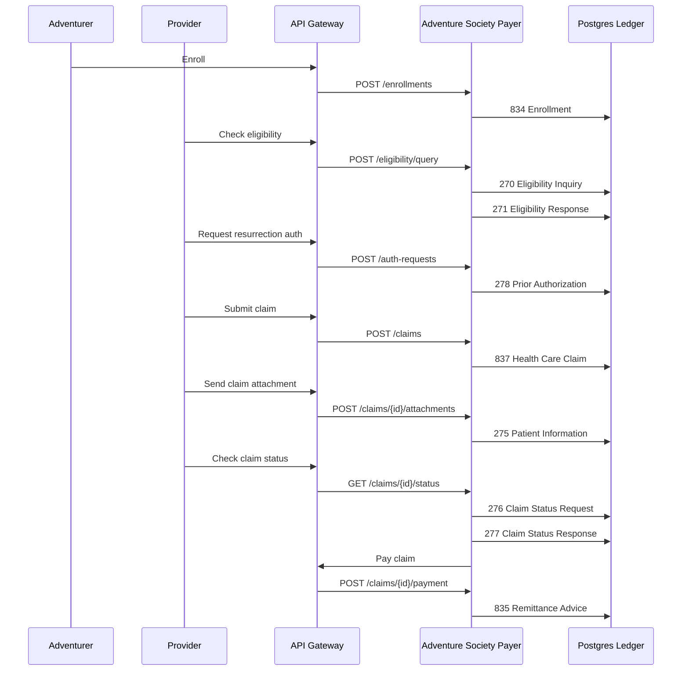

# ASHN X12 Workflow Breakdown

ASHN uses X12 healthcare transactions as the backbone of a fantasy healthcare demo. The project is not a full X12 parser or clearinghouse; it is an EDI-inspired simulator that makes the transaction lifecycle visible through services, API calls, persisted ledger records, and a dashboard.

The useful mental model is:

- **Adventure Society** = payer / health plan
- **Adventurer** = covered member / patient
- **Temple, clinic, or outpost** = provider
- **Dungeon injury or resurrection need** = medical event
- **Transaction ledger** = durable EDI event history

## Why X12 Matters Here

X12 is the family of standardized EDI transactions used by US healthcare organizations to exchange administrative information. In the real world, these messages move between providers, payers, clearinghouses, employers, and banks.

ASHN translates those ideas into a small working system:

- the dashboard and CLI trigger business actions
- the API gateway routes requests to payer and provider services
- the payer service creates EDI-inspired `Transaction` records
- each transaction captures type, status, sender, receiver, JSON payload, raw X12 text, and timestamp
- trading partner profiles validate external sender/receiver IDs and allowed transaction types
- Postgres stores the transaction ledger for search, filtering, and replayable demos

For a diagram-first view of the currently supported workflows, see [`supported-workflows.md`](supported-workflows.md).

## End-to-End Flow



## Transaction Map

| X12 | Real-world purpose | ASHN story version | Current status behavior |
| --- | --- | --- | --- | --- |
| `834` | Benefit enrollment and maintenance | Adventurer joins the Adventure Society plan | `Accepted` |
| `820` | Premium payment | Adventurer or sponsor pays premium dues | `Accepted`; available in the mock generator |
| `270` | Eligibility inquiry | Provider asks whether the adventurer has active coverage | `Dispatched` |
| `271` | Eligibility response | Society confirms or denies active coverage | `Accepted` when active, otherwise `Denied` |
| `275` | Patient information / attachments | Provider sends supporting claim or prior auth documentation | `Accepted`; linked to the source claim or authorization transaction |
| `278` | Prior authorization | Provider requests approval for high-severity care such as resurrection | Starts `Pending`; `tx-worker` later marks `Approved` or `Denied` |
| `837` | Health care claim | Provider submits a claim for the encounter | `Accepted` |
| `835` | Claim payment / remittance advice | Society pays the provider and explains the remittance | `Paid` |
| `276` | Claim status request | Provider asks for the current state of a claim | `Dispatched` |
| `277` | Claim status response | Society returns the claim’s current status | `Accepted` |
| `999` | Implementation acknowledgment | Intake confirms whether an XML submission was accepted or rejected | `Accepted` or `Failed` |
| `277CA` | Claim acknowledgment | Society confirms receipt of an `837` claim before adjudication | `Accepted` |
| `269` | Health care benefit coordination | Provider records primary/secondary payer coordination context | `Accepted` |

## How Each Step Works

### 1. Enrollment: `834`

When a user enrolls an adventurer, ASHN creates an adventurer record and emits an `834 Benefit Enrollment and Maintenance` transaction.

This represents the moment a member becomes known to the plan. The payload includes the adventurer profile, sponsor, and lore summary. The transaction sender is the adventurer ID and the receiver is the Society.

Raw delimiter-based `834` intake is available at `POST /v1/x12/raw`. The parser reads the member name from `NM1*IL` and ASHN demo metadata from `K3` lines (`Rank`, `Guild`, and `Region`) before forwarding the canonical enrollment request to `payer-core`.

### 1.5 Premium Payment: `820`

ASHN can record premium dues through `POST /v1/premium-payments`, canonical XML/JSON `820`, or raw delimiter-based `820` intake. The raw parser reads the adventurer/member identifier from `NM1*IL` and the paid amount from `RMR` or `BPR`, emits a `999`, and forwards the canonical premium payment request to `payer-core`.

Accepted `820` payments now participate in the benefit-plan simulation: a recent accepted premium marks the adventurer as premium-current for claim adjudication, slightly improving paid amount calculations and reducing patient responsibility in the async worker’s `277` adjudication payload.

### 2. Eligibility: `270 → 271`

Before treatment, a provider checks whether the adventurer is covered.

- `270 Eligibility Inquiry` is the provider asking the payer for coverage information.
- `271 Eligibility Response` is the payer answering with eligibility and coverage status.

In ASHN, active coverage returns an accepted `271`; inactive or unavailable coverage returns a denied-style response.

ASHN also supports a dental eligibility flavor. A `270` request with `serviceType=dental` or raw `EQ*35` produces a `271` response with dental benefit details: annual maximum, remaining maximum, preventive/basic/major coverage percentages, waiting period, and frequency limits. In raw X12 display, the dental response uses service type `35` plus benefit/frequency `EB` and `MSG` segments so the demo can explain dental benefits before `278` predetermination or `837D` claim submission.

### 3. Prior Authorization: `278`

Some services need approval before they happen or before they are reimbursed. ASHN models this with resurrection care because it is memorable and clearly high-stakes.

The `278 Prior Authorization Request` payload includes:

- adventurer ID
- provider ID
- requested service type
- optional dental predetermination detail such as CDT code, tooth number, surface, quadrant, and orthodontic indicator
- lore summary

The request is initially `Pending`. A dashboard reviewer can manually approve or deny it through the `POST /auth-requests/{transactionId}/decision` endpoint, which updates the stored authorization row and visible `278` transaction. If nobody reviews it manually, `payer-core` enqueues an `auth_review` job and `tx-worker` later updates the authorization and visible `278` transaction status to `Approved` or `Denied`.

Dental predeterminations add a payer review checklist for diagnostic x-rays, periodontal charting, clinical narrative, treatment plan, and optional orthodontic records. The dashboard renders those prompts in the authorization workbench and submits the evidence as linked `275` packet documents. Manual approval is blocked until every required dental document has an accepted attachment review; the async worker auto-denies dental predeterminations with a reason that points the reviewer back to the dental evidence checklist.

Raw delimiter-based `278` intake is available at `POST /v1/x12/raw`. The parser reads the provider and subscriber from `NM1`, extracts the requested service type from `UM`, derives incident severity from companion `HI` diagnosis codes, validates partner-specific service/severity rules, emits a `999`, and forwards the canonical prior authorization request to `payer-core`. Dental predetermination raw intake also maps the CDT procedure from `SV1*AD`, tooth number from `TOO`, surface/quadrant hints from `REF*D9`, and orthodontic indicators from `CRC*ZZ`.

The dashboard shows this as a small prior-auth review widget after the `278` is created:

- `Approve Auth` moves the `278` to `Approved`.
- `Deny Auth` moves the `278` to `Denied`.
- The async worker skips already-reviewed authorizations so a manual decision is not overwritten later.

### 4. Claim Submission: `837`

After the encounter, the provider submits an `837 Health Care Claim`.

In ASHN, the claim includes:

- adventurer ID
- provider ID
- incident severity
- claim amount
- optional diagnoses
- optional service lines, including dental `837D` CDT, tooth, surface, quadrant, and orthodontic details
- claim status
- linked transaction ID

The mock payload also adds a severity description so the fantasy event maps back to the claim type: normal wounds, awakened-tier injuries, or diamond-tier catastrophic cases. Claims can now carry diagnosis details plus service-line procedure code, description, units, and billed amount. Dental claims use `837D`, CDT-style `D` procedure codes, `SV3` dental service lines, tooth/surface/quadrant references, and optional orthodontic indicators. Payer-core defaults diagnoses from severity when none are supplied, validates ASHN-style or dental procedure codes, adjudicates service lines individually, rolls totals up to the claim, and emits diagnosis-aware `837`/`837D` plus line-level `835` remittance detail.

Raw delimiter-based `837` intake is available at `POST /v1/x12/raw` with `Content-Type: application/edi-x12` or `text/plain`. The first parser pass reads ASHN-style envelope segments (`ISA`, `GS`, `ST`, `SE`, `GE`, `IEA`), detects the transaction type from `ST01`, extracts claim data from `NM1`, `CLM`, `HI`, and all `SV1` service-line segments, audits the original raw payload, emits a `999`, and forwards the canonical claim request to `payer-core`. The same raw endpoint also maps `276` claim-status requests by reading the `REF*1K` payer claim reference and routing the request through the existing `276 → 277` claim-status workflow.

### 5. Patient Information Attachments: `275`

Some claims and prior authorization requests need extra supporting documentation. ASHN models this with a `275 Patient Information` transaction linked back to either the claim's original `837` transaction or the prior authorization `278` transaction through `relatedId`.

The payer can also solicit documentation by marking a claim `Pending Documentation` through `POST /claims/{id}/documentation-request`. That emits a related `277` status response with a structured documentation checklist, due date, expected `275` response, and `attachmentTraceId`. When a solicited `275` packet arrives, ASHN can require the attachment trace to match the latest payer documentation request before clearing the hold back to `Pending` and queuing claim finalization again.

For prior authorization, the dashboard and API can submit `POST /auth-requests/{transactionId}/attachments`. XML intake also accepts `<AuthorizationTransactionId>` inside a `275` `<Attachment>` payload. Claim attachments use `REF*1K`; authorization attachments use `REF*G1` in the generated X12.

ASHN also separates transaction acceptance from business review. A new `275` starts with `attachmentReviewStatus: Received`; reviewers can later call `POST /transactions/{id}/attachment-review` to mark the supporting documentation `Accepted` or `Rejected` without changing the original EDI transaction status.

Attachments can include embedded `content` or reference an external document with `documentReferenceId` and `documentReferenceUrl`. External references are useful for PDF/image-sized artifacts; generated X12 records the pointer in `K3*Document-Reference` and omits `BIN` when no embedded content is supplied. `GET /transactions/{id}/document-reference` resolves the vault receipt metadata for a `275` without server-side fetching arbitrary URLs, while `GET /transactions/{id}/document-reference/content` downloads embedded content when present.

ASHN also supports multi-attachment packets. A packet is represented as multiple `275` transactions that share a `packetId`, with `packetSequence` and `packetCount` showing each document's position in the packet. JSON callers can post an `attachments[]` packet to the existing claim or authorization attachment endpoints, and XML callers can use `<AttachmentPacket packetId="...">` with repeated `<Attachment>` children. Raw X12 emits `REF*F8` with the packet identifier and sequence/count marker.

Raw delimiter-based `275` intake is also supported at `POST /v1/x12/raw`. The parser extracts solicited/unsolicited purpose and trace from `BGN01/BGN02`, claim/auth correlation from `REF*1K` or `REF*G1`, attachment control from `REF*6R`/`PWK`, packet metadata from `REF*F8`, attachment type from `LQ*AT`, document references from `K3`, notes from `NTE`, and embedded content from `BIN`.

Unsolicited claim attachments now keep the originating `837` `PWK` attachment control values on the claim. When a provider submits a `275` for that claim, ASHN validates the `attachmentControlNumber` against those stored controls so the attachment trail reads as a linked `837` → `275` evidence chain instead of a loose document upload.

The extracted UHC/esMD companion-guide notes are summarized in [275 Companion Guide Notes](275-companion-guide-notes.md). ASHN now includes explicit solicited/unsolicited purpose via `BGN`, request-trace matching, companion-guide-inspired `LX`, `TRN`, `DTP`, `CAT`, `OOI`, and `BDS` metadata, loop/size limits, MIME/Base64 validation, `824` application reporting, and `TA1` envelope rejection examples.

In ASHN, a provider can submit:

- attachment type
- packet ID and sequence metadata
- attachment control number
- report type code
- transmission code
- content type
- description
- supporting content

This is the "supporting scroll" step: operative notes, dungeon incident reports, resurrection medical necessity, or other evidence the payer needs before adjudication.

The dashboard claim detail drawer includes a **275 Documentation Workbench** that shows required and optional documents, lets the payer request the checklist, and lets the provider submit a packet that creates one `275` transaction per checklist document. Each submitted document can then be reviewed independently as `Received`, `Accepted`, or `Rejected`, while the overall EDI transaction remains accepted. If a document is rejected, the workbench can generate a focused deficiency request and resubmit only the corrected document as a new related `275`.

ASHN also models partner-specific companion-guide rules. These are stored on each trading partner profile and enforced by `edi-intake` before the request is forwarded to `payer-core`. The payer still keeps its own backstop validation, but the EDI layer now owns the routing-facing companion-guide contract.

These rules are intentionally small but teach the real-world shape of partner-specific validation:

| Provider | `275` attachment profile | `837` diagnosis profile | `837` procedure profile | Dental profile |
| --- | --- | --- | --- |
| `provider-vitesse-temple` | `OZ`/`B4`, text/PDF/JPEG, `TEMPLE-`/`ATTACH-`/`XML-`, 4 KB | `ABK`/`ABF`; `S610`, `T509`, `S062X9A`, `K021` | `ASHN` or `D` prefix | `D7000-D7999`, tooth required, surfaces/quadrants constrained, `XRAY`/`PERIO`/`NARR`/`PLAN` docs |
| `provider-rimaros-hospital` | `OZ`/`PN`, `03`/`B4`, text/PDF, `RIM-`/`ATTACH-`/`XML-`, 8 KB | `ABK`/`ABF`; `S610`, `T509`, `S062X9A`, `M542` | `ASHN`, `RIM`, or `D` prefix | `D0000-D9999`, tooth optional, surfaces/quadrants constrained, `XRAY`/`NARR` docs |

Generated raw `275` X12 now keeps the existing claim/auth attachment path while emitting a `GS08` implementation version of `006020X314`. It includes `REF*1K` or `REF*G1` for correlation, `REF*6R` for the attachment control number, `PWK` for report/transmission metadata, `LQ*AT` for the attachment category, `K3` for content type or external document reference, and `BIN` when embedded content is present.

The same profile can also constrain `278` prior authorization service types, incident severities, and dental predetermination payloads. For dental workflows, `edi-intake` now checks allowed CDT ranges, tooth requirements, valid surfaces, valid quadrants, and payer-specific predetermination notes before routing the request.

The dashboard Partners tab surfaces those constraints as a compact companion-guide matrix: `275` attachment/report/content rules, `278` service/severity rules, `837` diagnosis/procedure rules, and dental CDT/tooth/surface attachment rules. This makes partner configuration readable before intentionally sending accepted or rejected intake examples.

### 6. Claim Status: `276 → 277`

A provider can ask what happened to a claim after submission.

- `276 Claim Status Request` asks for the status of a specific claim.
- `277 Claim Status Response` returns the current status from the payer ledger.

This pair is useful in demos because it shows that EDI is not just a one-way submission path. Providers often need follow-up transactions after the original claim.

### 7. Payment and Remittance: `835`

When a claim is paid, ASHN updates the claim status and emits an `835 Claim Payment / Remittance Advice`.

Before payment, `tx-worker` adjudicates the claim and calculates:

- billed amount
- allowed amount
- paid amount
- patient responsibility
- adjustment amount and reason
- denial reason, when applicable

The adjudication rules are intentionally explainable: severity and billed amount set the baseline, approved prior authorization can unlock catastrophic encounters, provider tier can improve allowance/payment, adventurer rank can reduce responsibility, recent accepted `820` premiums can improve paid amount, and inactive/suspended coverage denies the claim.

Dental claims keep that same `835` remittance flow, but service lines use dental `AD` procedure composites such as `SVC*AD:D7240`. Generated X12 also includes line-level `AMT*AU` allowed amount, `AMT*PR` patient responsibility, CDT/tooth/surface/quadrant references, orthodontic indicators, and denial reason segments when a dental line is not payable. The async adjudicator now applies dental benefit-plan categories by CDT range: preventive services pay at 100%, basic services at 80%, major services at 50%, and orthodontic services at 50%, with annual maximum caps based on rank and coverage context.

The `835` represents the payer saying: “Here is what we paid, what we allowed, what was adjusted, and why.” In the dashboard, this is the final satisfying ledger event: the healer gets paid and the claim reaches `Paid`.

Raw delimiter-based `835` intake is also available at `POST /v1/x12/raw`. The parser reads the claim ID and payment amount from `CLP`, falls back to `BPR` for the payment amount, validates the remittance trading partner, emits a `999`, and routes the payment through the existing claim payment endpoint.

## ASHN Transaction Record Shape

Every emitted X12-inspired event becomes a `Transaction` record:

```json
{
  "id": "transaction-id",
  "type": "837",
  "status": "Accepted",
  "senderId": "provider-vitesse-temple",
  "receiverId": "Adventure Society",
  "payload": {
    "x12": "837 Health Care Claim",
    "claim": {
      "id": "claim-id",
      "adventurerId": "adventurer-id",
      "providerId": "provider-vitesse-temple",
      "incidentSeverity": "Awakened",
      "amountCents": 125000,
      "status": "Submitted"
    }
  },
  "rawX12": "ISA*00*...~\nGS*HC*...~\nST*837*...~\nCLM*...~\nSE*...~",
  "createdAt": "2026-06-29T16:00:00Z"
}
```

The important architectural choice is that ASHN stores normalized business entities, such as adventurers and claims, while also storing the transaction ledger. That lets the app answer two different questions:

- **Current state:** What is this claim’s status right now?
- **Event history:** Which X12-style messages moved through the system?

## Service Responsibilities

| Service | Responsibility |
| --- | --- |
| `api-gateway` | Public demo API, routing, CORS, health aggregation, and public intake routes `POST /v1/x12/transactions` / `POST /v1/x12/xml` |
| `edi-intake` | XML/JSON representation handling, validation, audit, acknowledgments, and mapping into existing payer endpoints |
| `payer-core` | Enrollment, eligibility, authorization, claims, payments, transaction ledger, and business state ownership |
| `provider-service` | Provider registry and provider-facing lookup behavior |
| `dashboard` | Visual workflow, trading partner visibility, ledger search, filters, pagination, intake rejection operations, and detail views |
| `ashn-cli` | Scriptable demo workflow from the terminal |
| `tx-worker` | Polls queued async jobs for `278` authorization review and claim adjudication status transitions |

## Export and Replay

ASHN supports demo-oriented export and replay tools:

- transaction export as JSON, XML, or raw X12
- XML intake audit export as raw XML or JSON
- transaction replay, which records a new related ledger transaction
- inbound XML replay, which resubmits the original XML through validation, routing, audit, and acknowledgment flow
- multipart batch file-drop intake for XML, JSON, EDI, and X12 demo files
- operational rejection summaries for failed partner submissions, grouped by partner, transaction type, companion-guide-style validation reason, and day-level trend

This lets a demo operator capture a ledger event, show it outside the UI, and replay it back through the system for testing or storytelling.

## Trading Partner Routing

ASHN now models external trading partner profiles for XML intake. Each profile captures:

- partner name
- sender ID
- expected receiver ID
- allowed X12 transaction types
- route target, currently `payer-core`
- active/inactive status

When XML or JSON arrives, `edi-intake` first validates the canonical ASHN transaction shape and maps it to an internal payer request. Then it checks the trading partner seal:

1. The `Sender id` must match a known active partner.
2. The `Receiver id` must match that partner's expected receiver.
3. The requested X12 type must be allowed for that partner.
4. The route target must be supported.
5. Transaction-specific profile rules must pass, such as `275` attachment metadata, `278` service/severity rules, and `837` diagnosis/procedure constraints.

Accepted intake is forwarded to existing `payer-core` HTTP endpoints. Rejected intake still creates an inbound audit record, preserving the raw payload and validation error for debugging, export, and replay.

This gives the demo a realistic EDI boundary: not every external sender can submit every transaction type.

## What Is Real vs. Simplified

ASHN intentionally keeps the EDI layer lightweight, but the generated and parsed raw X12 now uses more companion-guide-inspired segment examples. Raw intake currently maps `834` enrollment, `820` premium payment, `270` eligibility, `269` benefit coordination, `276` claim status, `278` prior authorization and dental predetermination, `837` professional claim, `837D` dental claim, `835` remittance/payment, and `275` attachment messages into canonical ASHN requests. The parser build-vs-integrate recommendation is captured in [X12 Parser Strategy](x12-parser-strategy.md).

What it models well:

- transaction purpose and sequencing
- envelope and control segment structure
- representative loops such as payer, provider, subscriber, claim, service line, acknowledgment, and remittance
- payer/provider/member boundaries
- request/response pairs like `270 → 271` and `276 → 277`
- claim-to-payment lifecycle
- durable transaction history
- search and filtering across the ledger
- basic claim adjudication with remittance math

What it simplifies:

- production-grade X12 segment generation and companion-guide compliance
- full companion-guide validation
- clearinghouse routing
- full partner-specific companion-guide validation
- full benefits, COB, and production-grade denial logic
- PHI, HIPAA compliance, and production security concerns

That distinction is important: ASHN is a teaching and architecture simulator. It gives the team a clear foundation before deciding whether to add true X12 parsing, validation, acknowledgments, or clearinghouse-style routing later.

### Explicitly Out of Scope

ASHN does not currently model every valid X12 transaction set. Non-healthcare sets such as `101` Name and Address Lists, `110` Air Freight Details and Invoice, `201` Residential Loan Application, `210` Motor Carrier Freight Details and Invoice, and `215` Motor Carrier Pickup Manifest are outside the current payer/provider simulator. They are useful examples of X12's cross-industry reach, but they would require separate supply-chain, finance, or transportation workflows rather than being folded into the ASHN healthcare ledger. The proposed isolation model for `101`, `110`, and future non-healthcare modules is captured in [Cross-Industry EDI Module Notes](cross-industry-edi-modules.md).

## Demo Talk Track

“ASHN shows how healthcare X12 transactions fit together by turning them into a fantasy healthcare workflow.

An adventurer enrolls in the plan, which creates an `834`. A healer checks eligibility with `270 → 271`. If the care is severe, they request authorization with a `278`. After treatment, the provider submits an `837` claim, checks status with `276 → 277`, and eventually receives payment through an `835`.

Behind the story, every step is a real service call and every X12-inspired event is persisted to the ledger. The dashboard lets us search, filter, page through, and inspect those events, so the invisible EDI lifecycle becomes something we can actually see and explain.”

## Future X12 Enhancements

For the completed foundation and remaining implementation backlog, see [ASHN Future Enhancements TODO](future-enhancements.md).

Good next expansions include:

- add richer `820` premium payment history and reconciliation views
- expand raw X12 parsing beyond the current demo transaction subset
- add richer service-line and diagnosis mappings for claims
- add dental-specific eligibility, `278` predetermination, `837D` claim, `275` attachment, and `835` remittance workflows
