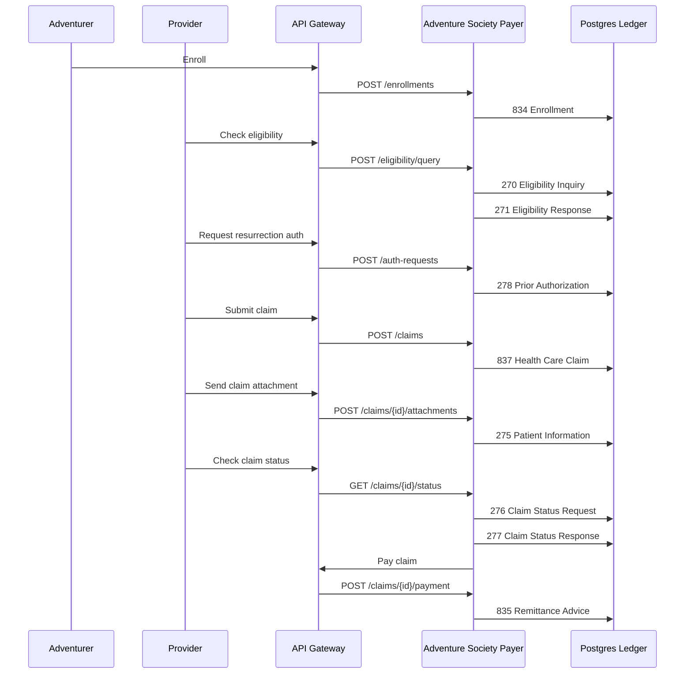

# ASHN X12 Workflow Breakdown

ASHN uses X12 healthcare transactions as the backbone of a fantasy healthcare demo. The project is not a full X12 parser or clearinghouse; it is an EDI-inspired simulator that makes the transaction lifecycle visible through services, API calls, persisted ledger records, and a dashboard.

The useful mental model is:

- **Adventure Society** = payer / health plan
- **Adventurer** = covered member / patient
- **Temple, clinic, or outpost** = provider
- **Dungeon injury or resurrection need** = medical event
- **Transaction ledger** = durable EDI event history

## Why X12 Matters Here

X12 is the family of standardized EDI transactions used by US healthcare organizations to exchange administrative information. In the real world, these messages move between providers, payers, clearinghouses, employers, and banks.

ASHN translates those ideas into a small working system:

- the dashboard and CLI trigger business actions
- the API gateway routes requests to payer and provider services
- the payer service creates EDI-inspired `Transaction` records
- each transaction captures type, status, sender, receiver, JSON payload, raw X12 text, and timestamp
- trading partner profiles validate external sender/receiver IDs and allowed transaction types
- Postgres stores the transaction ledger for search, filtering, and replayable demos

For a diagram-first view of the currently supported workflows, see [`supported-workflows.md`](supported-workflows.md).

## End-to-End Flow



## Transaction Map

| X12 | Real-world purpose | ASHN story version | Current status behavior |
| --- | --- | --- | --- |
| `834` | Benefit enrollment and maintenance | Adventurer joins the Adventure Society plan | `Accepted` |
| `820` | Premium payment | Adventurer or sponsor pays premium dues | `Accepted`; available in the mock generator |
| `270` | Eligibility inquiry | Provider asks whether the adventurer has active coverage | `Dispatched` |
| `271` | Eligibility response | Society confirms or denies active coverage | `Accepted` when active, otherwise `Denied` |
| `275` | Patient information / attachments | Provider sends supporting claim or prior auth documentation | `Accepted`; linked to the source claim or authorization transaction |
| `278` | Prior authorization | Provider requests approval for high-severity care such as resurrection | Starts `Pending`; `tx-worker` later marks `Approved` or `Denied` |
| `837` | Health care claim | Provider submits a claim for the encounter | `Accepted` |
| `835` | Claim payment / remittance advice | Society pays the provider and explains the remittance | `Paid` |
| `276` | Claim status request | Provider asks for the current state of a claim | `Dispatched` |
| `277` | Claim status response | Society returns the claim’s current status | `Accepted` |
| `999` | Implementation acknowledgment | Intake confirms whether an XML submission was accepted or rejected | `Accepted` or `Failed` |
| `277CA` | Claim acknowledgment | Society confirms receipt of an `837` claim before adjudication | `Accepted` |
| `269` | Health care benefit coordination | Reserved in the domain model for future coordination workflows | Not yet emitted |

## How Each Step Works

### 1. Enrollment: `834`

When a user enrolls an adventurer, ASHN creates an adventurer record and emits an `834 Benefit Enrollment and Maintenance` transaction.

This represents the moment a member becomes known to the plan. The payload includes the adventurer profile, sponsor, and lore summary. The transaction sender is the adventurer ID and the receiver is the Society.

### 2. Eligibility: `270 → 271`

Before treatment, a provider checks whether the adventurer is covered.

- `270 Eligibility Inquiry` is the provider asking the payer for coverage information.
- `271 Eligibility Response` is the payer answering with eligibility and coverage status.

In ASHN, active coverage returns an accepted `271`; inactive or unavailable coverage returns a denied-style response.

### 3. Prior Authorization: `278`

Some services need approval before they happen or before they are reimbursed. ASHN models this with resurrection care because it is memorable and clearly high-stakes.

The `278 Prior Authorization Request` payload includes:

- adventurer ID
- provider ID
- requested service type
- lore summary

The request is initially `Pending`. A dashboard reviewer can manually approve or deny it through the `POST /auth-requests/{transactionId}/decision` endpoint, which updates the stored authorization row and visible `278` transaction. If nobody reviews it manually, `payer-core` enqueues an `auth_review` job and `tx-worker` later updates the authorization and visible `278` transaction status to `Approved` or `Denied`.

The dashboard shows this as a small prior-auth review widget after the `278` is created:

- `Approve Auth` moves the `278` to `Approved`.
- `Deny Auth` moves the `278` to `Denied`.
- The async worker skips already-reviewed authorizations so a manual decision is not overwritten later.

### 4. Claim Submission: `837`

After the encounter, the provider submits an `837 Health Care Claim`.

In ASHN, the claim includes:

- adventurer ID
- provider ID
- incident severity
- claim amount
- claim status
- linked transaction ID

The mock payload also adds a severity description so the fantasy event maps back to the claim type: normal wounds, awakened-tier injuries, or diamond-tier catastrophic cases.

### 5. Patient Information Attachments: `275`

Some claims and prior authorization requests need extra supporting documentation. ASHN models this with a `275 Patient Information` transaction linked back to either the claim's original `837` transaction or the prior authorization `278` transaction through `relatedId`.

The payer can also solicit documentation by marking a claim `Pending Documentation` through `POST /claims/{id}/documentation-request`. That emits a related `277` status response with a structured documentation checklist, due date, and expected `275` response. When a valid `275` packet arrives, ASHN clears the hold back to `Pending` and queues claim finalization again.

For prior authorization, the dashboard and API can submit `POST /auth-requests/{transactionId}/attachments`. XML intake also accepts `<AuthorizationTransactionId>` inside a `275` `<Attachment>` payload. Claim attachments use `REF*1K`; authorization attachments use `REF*G1` in the generated X12.

ASHN also separates transaction acceptance from business review. A new `275` starts with `attachmentReviewStatus: Received`; reviewers can later call `POST /transactions/{id}/attachment-review` to mark the supporting documentation `Accepted` or `Rejected` without changing the original EDI transaction status.

Attachments can include embedded `content` or reference an external document with `documentReferenceId` and `documentReferenceUrl`. External references are useful for PDF/image-sized artifacts; generated X12 records the pointer in `K3*Document-Reference` and omits `BIN` when no embedded content is supplied.

ASHN also supports multi-attachment packets. A packet is represented as multiple `275` transactions that share a `packetId`, with `packetSequence` and `packetCount` showing each document's position in the packet. JSON callers can post an `attachments[]` packet to the existing claim or authorization attachment endpoints, and XML callers can use `<AttachmentPacket packetId="...">` with repeated `<Attachment>` children. Raw X12 emits `REF*F8` with the packet identifier and sequence/count marker.

In ASHN, a provider can submit:

- attachment type
- packet ID and sequence metadata
- attachment control number
- report type code
- transmission code
- content type
- description
- supporting content

This is the "supporting scroll" step: operative notes, dungeon incident reports, resurrection medical necessity, or other evidence the payer needs before adjudication.

The dashboard claim detail drawer includes a **275 Documentation Workbench** that shows required and optional documents, lets the payer request the checklist, and lets the provider submit a packet that creates one `275` transaction per checklist document. Each submitted document can then be reviewed independently as `Received`, `Accepted`, or `Rejected`, while the overall EDI transaction remains accepted. If a document is rejected, the workbench can generate a focused deficiency request and resubmit only the corrected document as a new related `275`.

ASHN also models partner-specific companion-guide rules. These are stored on each trading partner profile and enforced by `edi-intake` before the request is forwarded to `payer-core`. The payer still keeps its own backstop validation, but the EDI layer now owns the routing-facing companion-guide contract.

These rules are intentionally small but teach the real-world shape of `275` validation:

| Provider | Allowed attachment types | Allowed report types | Transmission | Content types | Control prefixes | Size limit |
| --- | --- | --- | --- | --- | --- | --- |
| `provider-vitesse-temple` | `OZ` | `B4` | `EL` | `text/plain` | `TEMPLE-`, `ATTACH-`, `XML-` | 4 KB |
| `provider-rimaros-hospital` | `OZ`, `PN` | `03`, `B4` | `EL` | `text/plain`, `application/pdf` | `RIM-`, `ATTACH-`, `XML-` | 8 KB |

Generated raw X12 includes `REF*1K` or `REF*G1` for correlation, `REF*6R` for the attachment control number, `PWK` for report/transmission metadata, `LQ*AT` for the attachment category, `K3` for content type or external document reference, and `BIN` when embedded content is present.

The same profile can also constrain `278` prior authorization service types and incident severities, which gives demos a single place to explain sender IDs, allowed transaction sets, routing, and partner-specific validation.

### 6. Claim Status: `276 → 277`

A provider can ask what happened to a claim after submission.

- `276 Claim Status Request` asks for the status of a specific claim.
- `277 Claim Status Response` returns the current status from the payer ledger.

This pair is useful in demos because it shows that EDI is not just a one-way submission path. Providers often need follow-up transactions after the original claim.

### 7. Payment and Remittance: `835`

When a claim is paid, ASHN updates the claim status and emits an `835 Claim Payment / Remittance Advice`.

Before payment, `tx-worker` adjudicates the claim and calculates:

- billed amount
- allowed amount
- paid amount
- patient responsibility
- adjustment amount and reason
- denial reason, when applicable

The adjudication rules are intentionally explainable: severity and billed amount set the baseline, approved prior authorization can unlock catastrophic encounters, provider tier can improve allowance/payment, adventurer rank can reduce responsibility, and inactive/suspended coverage denies the claim.

The `835` represents the payer saying: “Here is what we paid, what we allowed, what was adjusted, and why.” In the dashboard, this is the final satisfying ledger event: the healer gets paid and the claim reaches `Paid`.

## ASHN Transaction Record Shape

Every emitted X12-inspired event becomes a `Transaction` record:

```json
{
  "id": "transaction-id",
  "type": "837",
  "status": "Accepted",
  "senderId": "provider-vitesse-temple",
  "receiverId": "Adventure Society",
  "payload": {
    "x12": "837 Health Care Claim",
    "claim": {
      "id": "claim-id",
      "adventurerId": "adventurer-id",
      "providerId": "provider-vitesse-temple",
      "incidentSeverity": "Awakened",
      "amountCents": 125000,
      "status": "Submitted"
    }
  },
  "rawX12": "ISA*00*...~\nGS*HC*...~\nST*837*...~\nCLM*...~\nSE*...~",
  "createdAt": "2026-06-29T16:00:00Z"
}
```

The important architectural choice is that ASHN stores normalized business entities, such as adventurers and claims, while also storing the transaction ledger. That lets the app answer two different questions:

- **Current state:** What is this claim’s status right now?
- **Event history:** Which X12-style messages moved through the system?

## Service Responsibilities

| Service | Responsibility |
| --- | --- |
| `api-gateway` | Public demo API, routing, CORS, health aggregation, and public intake routes `POST /v1/x12/transactions` / `POST /v1/x12/xml` |
| `edi-intake` | XML/JSON representation handling, validation, audit, acknowledgments, and mapping into existing payer endpoints |
| `payer-core` | Enrollment, eligibility, authorization, claims, payments, transaction ledger, and business state ownership |
| `provider-service` | Provider registry and provider-facing lookup behavior |
| `dashboard` | Visual workflow, trading partner visibility, ledger search, filters, pagination, and detail views |
| `ashn-cli` | Scriptable demo workflow from the terminal |
| `tx-worker` | Polls queued async jobs for `278` authorization review and claim adjudication status transitions |

## Export and Replay

ASHN supports demo-oriented export and replay tools:

- transaction export as JSON, XML, or raw X12
- XML intake audit export as raw XML or JSON
- transaction replay, which records a new related ledger transaction
- inbound XML replay, which resubmits the original XML through validation, routing, audit, and acknowledgment flow

This lets a demo operator capture a ledger event, show it outside the UI, and replay it back through the system for testing or storytelling.

## Trading Partner Routing

ASHN now models external trading partner profiles for XML intake. Each profile captures:

- partner name
- sender ID
- expected receiver ID
- allowed X12 transaction types
- route target, currently `payer-core`
- active/inactive status

When XML or JSON arrives, `edi-intake` first validates the canonical ASHN transaction shape and maps it to an internal payer request. Then it checks the trading partner seal:

1. The `Sender id` must match a known active partner.
2. The `Receiver id` must match that partner's expected receiver.
3. The requested X12 type must be allowed for that partner.
4. The route target must be supported.

Accepted intake is forwarded to existing `payer-core` HTTP endpoints. Rejected intake still creates an inbound audit record, preserving the raw payload and validation error for debugging, export, and replay.

This gives the demo a realistic EDI boundary: not every external sender can submit every transaction type.

## What Is Real vs. Simplified

ASHN intentionally keeps the EDI layer lightweight, but the generated raw X12 now uses more companion-guide-inspired segment examples.

What it models well:

- transaction purpose and sequencing
- envelope and control segment structure
- representative loops such as payer, provider, subscriber, claim, service line, acknowledgment, and remittance
- payer/provider/member boundaries
- request/response pairs like `270 → 271` and `276 → 277`
- claim-to-payment lifecycle
- durable transaction history
- search and filtering across the ledger
- basic claim adjudication with remittance math

What it simplifies:

- production-grade X12 segment generation and companion-guide compliance
- full companion-guide validation
- clearinghouse routing
- full partner-specific companion-guide validation
- full benefits, COB, and production-grade denial logic
- PHI, HIPAA compliance, and production security concerns

That distinction is important: ASHN is a teaching and architecture simulator. It gives the team a clear foundation before deciding whether to add true X12 parsing, validation, acknowledgments, or clearinghouse-style routing later.

## Demo Talk Track

“ASHN shows how healthcare X12 transactions fit together by turning them into a fantasy healthcare workflow.

An adventurer enrolls in the plan, which creates an `834`. A healer checks eligibility with `270 → 271`. If the care is severe, they request authorization with a `278`. After treatment, the provider submits an `837` claim, checks status with `276 → 277`, and eventually receives payment through an `835`.

Behind the story, every step is a real service call and every X12-inspired event is persisted to the ledger. The dashboard lets us search, filter, page through, and inspect those events, so the invisible EDI lifecycle becomes something we can actually see and explain.”

## Future X12 Enhancements

For the prioritized implementation backlog, including the proposed XML EDI intake service, see [ASHN Future Enhancements TODO](future-enhancements.md).

Good next expansions include:

- model `820` premium payment in the visible workflow
- add full companion-guide validation profiles per trading partner
- add retry, dead-letter, and replay controls for async job processing
- add richer service-line and diagnosis mappings for claims
